# Plan: Gameplay Journey v1（普通人 → 化虚 100h 主线）

> **总线 plan / Meta plan**——不新增子系统，而是把现有 35+ 个已落地子系统、28 个 active plan、9 个 skeleton plan 串成一条**玩家可走完**的 100h 游玩路径。本 plan 的产物不是代码，而是：(1) 路径图(P0→P5)；(2) 缺口依赖图(必须先补哪些 plan)；(3) E2E 通关验收脚本。
>
> **三方合并产物**(2026-05-01)：本 v1 由三份独立起草稿交叉验证后合并：
> - **opus 稿**(原 `plan-gameplay-journey-v1-opus.md`)：贡献骨架——接入面 Checklist / 阶段总览 / P0-P5 主体 / 七流派与四大产出横向 / 22 plan 依赖图执行序 / §H E2E 验收脚本
> - **gpt 稿**(`plan-playthrough-100h-gpt-v1.md`)：贡献工程红线——§I 代码↔正典差异 + MVP 取舍 / §K 世界观红线 10 条 / §F 加速器 30% Clamp / 三栏占比表
> - **deepseek 稿**(`plan-player-journey-deepseek.md`)：贡献体验填充——§J library 16 本馆藏锚点 / §L 新手 30min 分钟级钩子 + 5 句 narration 风格基准台词 / §M race-out + 避劫负灵域 + 多周目传承 / §N 化虚后世界变量
> - **§O 开放问题**：合并 gpt §12 + deepseek §12 共 15 个待决策点
>
> 原三稿审计痕迹：opus 已重命名为本 v1；gpt 稿留在 `plans-skeleton/`；deepseek 稿留在 `docs/` 顶层(位置违规，待人工迁移或删除)。**本 v1 是 active 升级的唯一候选**。

---

## 接入面 Checklist（防孤岛）

- **进料**：本 plan 不消费 runtime 数据，消费的是**已写好的 plan 文档**——`docs/finished_plans/*.md`(48 份) + `docs/plan-*.md`(28 份 active) + `docs/plans-skeleton/*.md`(9 份骨架)。每段路径引用具体 plan。
- **出料**：(a) 一份玩家旅程剧本(P0-P5)；(b) 一份依赖图(哪些缺口 plan 必须先升级 active 才能跑通本路径)；(c) 一组 E2E 通关 script(每境界一段，覆盖 client→server→agent→redis→client 全链路)。
- **共享类型 / event**：本 plan 不定义新 component / event / schema，全部复用既有(`cultivation::Realm/Cultivation/BreakthroughRequest`、`forge::*`、`alchemy::*`、`world::extract_system::*`、`tsy::*`、IPC schema 127 sample)。**任何"需要新增 X"的发现 → 写进 §G 依赖图，单独起子 plan，不在本 plan 内动手**。
- **跨仓库契约**：路径每段同时跨 server(Bevy ECS) + agent(tiandao narration) + client(Fabric HUD/UI) + worldgen(profile) + redis(IPC)。每段标注"五面齐 / 缺哪一面"。
- **worldview 锚点**：`docs/worldview.md` §三(六境界)+§四(战力分层)+§五(战斗流派)+§六(个性三层)+§七(生态)+§八(天道)+§九(经济)+§十(资源/搜打撤)+§十二(死亡寿元)+§十三(地理)+§十六(活坍缩渊秘境)+§十七(末法节律)。**几乎全卷锚定**——这就是为什么是总线 plan。

---

## 阶段总览（六境界对齐）

| 阶段 | 境界跃迁 | 主线时长(worldview §三基线) | 累计 | 验收日期 | 状态 |
|------|---------|--------------------------|------|---------|------|
| P0 | 醒灵 → 引气 | 0.5h | 0.5h | — | ⬜ |
| P1 | 引气 → 凝脉 | +3h | 3.5h | — | ⬜ |
| P2 | 凝脉 → 固元 | +8h | 11.5h | — | ⬜ |
| P3 | 固元 → 通灵 | +15h | 26.5h | — | ⬜ |
| P4 | 通灵 → 化虚 | +25h | 51.5h | — | ⬜ |
| P5 | 渡虚劫(事件) | +1-2 in-game day | 51.5h+ | — | ⬜ |
| 支 | 流派/搜打撤/社交支线 | +48.5h(填到 100h) | 100h | — | ⬜ |

**100h 预算分配**：51.5h 主线 + 30h 搜打撤循环(秘境多周目) + 10h 流派精进与切换实验 + 5h 社交博弈与灵龛战 + 3.5h 灵田经营/MC 建造缓冲。

---

## P0 — 醒灵开局：化身废土凡人(0-0.5h) ⬜

> "你在末法残土的一处灰烬下醒来，身边只有一柄锈刃和半口残钵。"

### 玩家旅程

1. **生成于 spawn_plain**（worldgen profile `spawn_plain.py`，0,0 ±300，灵气浓度 0.3）。
2. **醒灵态**(`Realm::Awaken`)：HUD 无灵气条，只有体力(stamina)+饥饿+生命+伤口剪影(`MiniBodyHudPlanner`)。**没有真元**——客户端禁用真元渲染。
3. **凡器获取**：拾取生锈的 `ToolTag::Knife/Hoe/Sickle/Scraper`(`tools/` 已实装)，开始第一次裸手伐木 → 触发 `WoundOnBareHand`(plan-tools-v1.md ✅) → 教学反馈"凡铁亦是身外之物"。
4. **第一次采集**：在 spawn_plain 的灵草丛(botany 22 种植物 plan-botany-v1 ✅) 用刮刀(`ToolTag::Scraper`)挖出 1 株低级灵草 → `botany::HarvestProgress` 通知 → 采集技能 +1。
5. **遇见 NPC**：散修(big-brain `Rogue` archetype)主动 narration "你也是新醒来的？这地方……" → social 模块第一次曝光(`social::Renown`)。
6. **静坐突破**(0.5h 后)：找到灵气 >0.5 的小灵泉(spawn_plain 内 1-2 处脚本化布置) → 服用 1 颗**开脉丹**(plan-alchemy-v1 ✅，新手 quest 配方 give) → 静坐 3 分钟 → `BreakthroughRequest{from:Awaken, to:Induce}` → tiandao **era_decree** narration 全服广播玩家觉醒(skills/era.md ✅) → 进入引气期。

### 系统接入面

- **server**：`cultivation::Realm::Awaken→Induce` ✅ / `BreakthroughRequest`(`first-realm` 走 `Realm` 转换 path) ✅
- **agent**：tiandao `era` skill ✅ 已支持新玩家觉醒 narration（**需补**：首次觉醒 vs 后续突破的语调区分，挂 narrative-v1 子任务）
- **client**：`MiniBodyHudPlanner` ✅ / 灵气条 conditional hide(memory: HUD 沉浸式极简)
- **worldgen**：`spawn_plain.py` ✅ — 需脚本化注入"教学小灵泉(灵气>0.5)+开脉丹宝箱+1 个友善散修 NPC"
- **schema**：`world-state` / `realm-vision-awaken` / `event-alert` 全有 sample

### 验收抓手

- 测试：`server/src/cultivation/realm/tests::awaken_to_induce_full_flow` 端到端(已可写)
- E2E script：`scripts/e2e/p0-awaken.sh` 启 server+agent+client 自动模拟新玩家从 spawn 走到突破
- 视频：客户端跑 0.5h 实录，HUD 切换证据(灵气条从 hidden → visible)

### P0 缺口

- spawn_plain 教学注入(灵泉/箱子/友善 NPC)：plan-spawn-tutorial-v1 ✅ active (2026-05-03，commit 521e3a81，7 决策闭环)
- 首次突破 vs 后续突破 narration 区分：派生 `plan-narrative-v1` 子任务（5 句风格基准已写入本 plan §A.5 plan-spawn-tutorial-v1 P2 落地清单）

---

## P1 — 引气筑基：三件凡器·第一颗丹·第一片灵田(0.5-3.5h) ⬜

> "灵气如潮，识海初开。学会借物——锄头、丹炉、田垄。"

### 玩家旅程（5 条并行 loop，玩家自选轻重）

1. **修炼 loop(主)**：在 spawn_plain 或附近 `broken_peaks`(灵气 0.5)静坐攒真元 → 第一次目击异变兽(噬元鼠群 plan-fauna-v1 ⬜ → 暂以普通 zombie 替代) → 第一次小战斗 → 战斗后伤口/经脉受损(`combat::resolve` ✅ + `MeridianSystem` ✅)。
2. **凡器→法器升级 loop**：积攒铁/铜/低阶灵石(`mineral` 18 种 ✅) → 在 broken_peaks 找到第一座**炼器台**(forge `Station`，server ✅，client UI ⏳ 等 plan-forge-leftovers-v1) → 走完四步状态机(Tempering→Inscription→Consecration) → 产出 `BilletProfile::Common` 法器 → emit `forge-outcome-perfect` ✅。
3. **炼丹 loop**：拾取灵草/低阶灵石 → 找到丹炉(alchemy `Furnace` ✅，client UI ⏳ 等 plan-alchemy-client-v1 P1+)→ 烧出第一颗 `凝脉散`(plan-alchemy-v1 ✅ 配方表) → 服用提升修炼速度。
4. **灵田 loop**：在湿润地带找到一格 `LingtianPlot`(plan-lingtian-v1 ✅，剩 BlockEntity 持久化 ⏳) → 用 `Hoe` 开垦 → 撒灵草种子 → 浇水/补灵 → 1-2 in-game day 后收获 → 第一份"自产灵草"。
5. **MC 原生 loop**：建造草棚遮风/挖石搭灶/夜晚抗僵尸 — 与修仙完全平行，体力恢复/睡眠重置等保留原生(server 不拦截 vanilla)。

### 突破节点(3h 末)

满足 `引气→凝脉` 突破条件(worldview §三 line 100-131)：6 条正经全通 + 真元池满 + 局部循环成形 → 服用自炼/拾取 `凝脉散` → 全服 narration "某玩家凝出第一缕真元循环"。

### 系统接入面

- **server**：cultivation/forge/alchemy/lingtian/tools/mineral/combat/botany 全 ✅
- **agent**：tiandao 全 5 skill ✅；**缺**：forge/alchemy/lingtian event → agent 链路(plan-cross-system-patch-v1 在做 24 处)
- **client**：forge UI ⏳ / alchemy UI ⏳(P1+) / 灵田 UI ✅
- **worldgen**：broken_peaks(qingyun_peaks) ✅ — 需要注入"炼器台 POI / 丹炉 POI / 散修聚居点"(派生 `plan-poi-novice-v1`)
- **schema**：alchemy/forge/lingtian/botany sample 全齐

### 验收抓手

- 单元：`forge::session::tests::four_step_full_flow` ✅ / `alchemy::session::tests::full_brew_flow` ✅
- E2E：`scripts/e2e/p1-induce.sh` — 模拟玩家依次完成"炼第一件法器 + 烧第一颗丹 + 收第一茬灵草 + 突破到凝脉"
- 验收：3h in-game 实测路径可走通

### P1 缺口

- forge client UI 收尾(plan-forge-leftovers-v1 ⬜ → 必须升 active)
- alchemy client UI 进度(plan-alchemy-client-v1 P1-P6 ⬜ → 必须升 active)
- 妖兽骨系统(plan-fauna-v1 ⬜ → 必须起 active；P1 暂用 zombie 占位但 P2+ 必须正典化)
- POI 注入：plan-poi-novice-v1 ✅ active (2026-05-03，commit b68b8d45)

---

## P2 — 凝脉分化：流派抉择·灵眼·第一次搜打撤(3.5-11.5h) ⬜

> "经脉拓扑选择不可逆。你是要爆脉直撞、暗器毒蛊、还是垒石布阵？这是你这一生第一次对天道说不。"

### 玩家旅程（三条主轴）

#### 轴 1：流派分化(worldview §五·§六 个性三层 line 1)

凝脉期是**经脉拓扑选择窗口**，玩家必须在 5h 内做 1 次不可逆选择(`cultivation::topology` ✅ 已支持)，决定主流派树：

> **2026-05-03 状态更新**：6 流派 plan 已全部从 skeleton 升 active（zhenfa / anqi / dugu / zhenmai / tuike / woliu）+ baomai-v1 已实装 + spirit-eye-v1 升 active 规范化 + fauna-v1 ✅ finished (2026-05-02 d2ee8a0b 归档)。**P2 流派分化轴主要 plan 缺口已闭合**。剩余 P2 缺口：style-pick-ui（派生 plan-style-pick-v1）。

| 流派 | 攻击/防御 | 关键依赖 plan | 路径线索 |
|------|---------|---------------|---------|
| 体修(爆脉) | 攻 | plan-baomai-v1 ✅ | broken_peaks 找一具断臂修士尸体，悟"血肉之躯亦是法器" |
| 器修(暗器) | 攻 | plan-anqi-v1 ✅ active (2026-05-03) | 幽暗地穴(cave_network)拾"含毒铜针残卷" |
| 地师(阵法) | 攻 | plan-zhenfa-v1 ✅ active (2026-05-03) | 灵泉湿地(spring_marsh)目睹一座废弃欺天阵 |
| 毒蛊 | 攻 | plan-dugu-v1 ✅ active (2026-05-03) | 血谷(rift_valley)从蛛巢取出第一只蛊母 |
| 截脉(震爆) | 防 | plan-zhenmai-v1 ✅ active (2026-05-03，P0 已实装于 plan-combat-no_ui) | 凝脉突破后 narration 自然解锁试用 |
| 替尸/蜕壳 | 防 | plan-tuike-v1 ✅ active (2026-05-03) | cave_network 找到上一任替尸者残蜕 |
| 涡流(绝灵) | 防 | plan-woliu-v1 ✅ active (2026-05-03) | 北荒(waste_plateau)边缘负压区静修触发 |

**选择动作**：每条流派的解锁通过对应的"染色丹/染色事件"触发 → `cultivation::QiColor` 主色登记 ✅(已实装 10 染色)+ `UnlockedStyles` ✅ → 客户端 `combat::UnlockedStylesStore` 解锁对应 SkillBar 槽位。

> **不锁流派**：玩家**可以选择全流派精通**——但代价是阶段停留时间显著拉长 + 突破要求叠加。worldview §六 个性三层把流派定为"路径倾向"而非"职业锁"，本 plan 据此设计四档专精路线(详见 §A 全流派精通路径)。
>
> 单流派玩家 P2 段 8h 走完；双流派(1攻+1防)+12h；三流派+18h；**全 7 流派精通+35h**(P2 段从 8h 拉到 43h，整体 100h 路径变 135h，但玩家自愿)。

#### 轴 2：灵眼坐标(凝脉→固元 突破必需，worldview §十)

`plan-spirit-eye-v1` ⬜ 必须升 active：

- 灵眼 = 地图上 0.7+ 浓度+局部稳定的稀有点(spring_marsh 内 1-2 处，rift_valley 高危区 2-3 处)
- 玩家通过 `spiritual_sense::condense` ✅ 神识扫描定位
- 抵达后静坐凝核 → 完成凝脉→固元突破前置(worldview §三 line 117-122)

#### 轴 3：第一次搜打撤(轻度·tsy_zongmen_ruin 浅层)

- 通过 `world::rift_portal` ✅ 进入活坍缩渊秘境(plan-tsy-* 全 ✅)
- **入场只能带凡物**(worldview §十)：身上灵器/法器自动锁回背包 → 客户端用 `tsy::ExtractInteractionBootstrap` ✅ 校验
- 浅层(tsy_zongmen_ruin 1-3 层)：99 探索者遗物 + 1 上古遗物概率，PVP 收割场
- **撤离仪式**：找到主裂缝 → `StartExtractRequest` ✅ → 静立 7-15s(被打断失败) → `extract-completed` ✅
- 第一次搜打撤是教学：**死了 100% 掉物 + 5% 寿元**(worldview §十二)，刻意设计"第一次必死或险胜"

### 系统接入面

- **server**：cultivation/topology ✅ / QiColor ✅ / extract_system ✅ / tsy ✅；**缺** zhenfa/spirit_eye/anqi/dugu/tuike/woliu/zhenmai 模块
- **agent**：tiandao narration 已支持流派切换叙事(skills/insight.md)；**缺**：染色锁定时的"道路确认" narration
- **client**：UnlockedStylesStore ✅ / ExtractInteractionBootstrap ✅；**缺**：流派选择 UI(派生 `plan-style-pick-ui-v1`)、灵眼标记 UI(并入 plan-spirit-eye-v1)
- **worldgen**：broken_peaks/spring_marsh/cave_network/rift_valley/waste_plateau/tsy_zongmen_ruin 全 ✅；需要在 spring_marsh + rift_valley **注入灵眼 POI**(并入 plan-spirit-eye-v1)
- **schema**：流派切换无专属 payload(调研 §7) → **必须新增** `client-request.style-pick` schema(派生 `plan-style-pick-schema-v1`，或并入 plan-style-pick-ui-v1)

### 验收抓手

- E2E：`scripts/e2e/p2-condense.sh` — 模拟玩家完成"流派选择 + 找到灵眼 + 第一次搜打撤(撤离/失败两路径) + 凝脉→固元突破"
- 测试：`server/src/cultivation/topology::tests::lock_color_irreversible`
- 视频：流派选择那一刻的 narration + 染色锁定 + UI 解锁连贯展示

### P2 缺口（最大缺口阶段）

> **2026-05-03 大幅闭合**：6 流派 plan 全部升 active。

| 缺口 | 当前状态 | 行动 |
|------|---------|------|
| zhenfa-v1 | ✅ active (2026-05-03，13+5 决策闭环) | P0 实装（commit 6c00602d / fc7d4854）|
| anqi-v1 | ✅ active (2026-05-03，11 决策闭环) | P0 实装（commit 20b35224）|
| dugu-v1 | ✅ active (2026-05-03，11 决策闭环) | P0 实装（commit 84d3e320）|
| zhenmai-v1 | ✅ active (2026-05-03，10 决策；P0 已实装于 plan-combat-no_ui) | P1 实装（commit 530d6d53）|
| tuike-v1 | ✅ active (2026-05-03，6 决策 + 2 reframe) | P0/P1 实装（commit 5b90b758）|
| woliu-v1 | ✅ active (2026-05-03，9 决策 + hotbar 正典化) | P0/P1 实装（commit 121dbf70）|
| **spirit-eye-v1** | ✅ active (2026-05-03 规范化升级，7 决策闭环) | P0-P5 全 v1 范围实装中 |
| **style-pick-ui + schema** | 不存在 | 派生 `plan-style-pick-v1` |
| **fauna-v1** | ✅ finished (2026-05-02，commit d2ee8a0b 归档) | 噬元鼠 / 异变兽核 / 封灵骨币 / forge 正典化全 ✅ |

**worldview 同期更新**（commit fe00532c）：末土后招原则 + 身份与信誉系统 + 毒 vs 毒蛊边界正典化（接 plan-identity-v1 vN+1）。

---

## P3 — 固元秘境：阵法·异变兽核·中阶搜打撤·社交博弈(11.5-26.5h) ⬜

> "12 正经全通，识他人境界。世界对你而言，开始有政治。"

### 玩家旅程（四条主轴）

#### 轴 1：阵法落地实战(plan-zhenfa-v1)

- 学会布"小型聚灵阵"(灵泉湿地灵田周边 → 提高灵气 +0.1/0.2)
- 学会布"诱敌缚阵"(搜打撤入场前在自家洞口设伏)
- 第一次目睹/参与"欺天阵"(worldview §八)：天道刷异变兽密度 → 玩家用阵法把灵物分仓存放对抗 magnitude 阈值

#### 轴 2：异变兽核猎场(rift_valley)

- 固元→通灵突破必需：异变兽核(worldview §十)
- rift_valley 是高危场：高级野兽 + 天劫多发(rift_axis_sdf 默认值经过校验)
- 屠宰系统 ✅(`fauna::butcher`) → 异变兽核 drop 通过 plan-fauna-v1(必须 active)
- 多人联机：组队猎场博弈 — 谁补的最后一刀？(`combat::lifecycle::DeathEventAttackerChain` ✅)

#### 轴 3：中阶搜打撤(tsy_daneng_crater + tsy_zhanchang)

- **执念最多 + 畸变体最多** 副本，需要复合流派
- 浅 → 深层切换：首次进深层
- jackpot 物：上古残卷(plan-mineral 已支持)、破损法器、丹方碎片
- 死亡损失阶梯化：固元期一死掉 50% 物 + 5% 寿元 + 3min 虚弱(plan-death-lifecycle-v1 ✅)

#### 轴 4：社交博弈深化(plan-social-v1 ✅)

- **第一次设立灵龛**(`SpiritNicheRevealBootstrap` ✅) — 选择匿名 / 半曝光 / 实名(三档)
- **第一次交易**：盲盒死信箱(社交模块 ✅)、游商傀儡 NPC
- **第一次结仇**(`feud` ✅) / **第一次结契**(`pact` ✅)
- **被抄家威胁**：plan-niche-defense-v1 ⬜ skeleton 必须升 active(P3 必需)

### 系统接入面

- **server**：cultivation `Realm::Solidify→Spirit` ✅ / fauna butcher ✅ / social 全套 ✅ / tsy 4 副本 ✅
- **agent**：era_decree 全服可见的"政治叙事"已支持；**缺**：基于 social graph 的政治 narration(派生 `plan-narrative-political-v1`)
- **client**：social UI ✅ / SparringInvite ✅ / TradeOffer ✅；**缺**：阵法布置 UI(plan-zhenfa-v1)、灵龛防御 UI(plan-niche-defense-v1)
- **worldgen**：rift_valley / cave_network / tsy_daneng_crater / tsy_zhanchang 全 ✅
- **schema**：fauna drop / 阵法触发 / 灵龛防御均**未定义**(派生 schema 增量任务，并入对应 plan)

### 验收抓手

- E2E：`scripts/e2e/p3-solidify.sh` — 完成"布阵 + 猎兽核 + 跑两次副本 + 立灵龛(并被入侵一次) + 突破固元→通灵"
- 测试：`npc::tests::npc_attack_player_niche` / `social::tests::feud_renown_decay`

### P3 缺口

- plan-fauna-v1 升 active(必需)
- plan-niche-defense-v1 升 active(必需)
- plan-narrative-political-v1 派生
- 阵法 schema / 灵龛防御 schema 增量

---

## P4 — 通灵生态：顶级搜打撤·守家·渡虚劫准备(26.5-51.5h) ⬜

> "奇经四通，感受到天道在看你。"

### 玩家旅程

#### 轴 1：顶级搜打撤循环(tsy 全 4 副本深层)

- 周目化：每周/每两周刷新副本(plan-tsy-lifecycle-v1 ✅)
- 深层 jackpot：上古遗物(脆化一次性 worldview §十)、化虚级丹方残篇
- 死亡惩罚顶峰：通灵期一死掉 50% 物 + 5% 寿元 + 干尸→道伥(可能在副本内被同副本玩家击杀复活成 NPC ⚠️ 需 plan-tsy-hostile-v1 已 ✅)
- "搜打撤刷成富商" 路径：稳定 30h 在副本里跑(对应 100h 中的 30h 搜打撤预算)

#### 轴 2：守家循环(plan-niche-defense-v1)

- 自家灵龛 = 玩家私人空间(MC 原生建造 + 修仙阵法叠加)
- 用 `npc::npc_attack_player_niche` ✅ 招守家傀儡(plan-fauna-v1 妖兽骨壳+魂魄)
- 布"绝灵涡流阵"(若选涡流流派) / "震爆截脉阵"(若选截脉流派) → 流派与守家深度耦合
- 被抄家时全服 narration 广播(高 renown 玩家事件)

#### 轴 3：MC 原生大建造融合

- 100h 玩家通常已积累足够材料造**修仙宅邸**：
  - 顶层灵田阵(P1 灵田 + P3 阵法叠加)
  - 中层炼丹/炼器房(P1 炉/台 + P2 流派加成)
  - 地下灵眼引气阵(P2 灵眼坐标 + 引气阵)
  - MC 原生红石/水利可作辅助灌溉/陷阱触发(server 不拦截 vanilla)

#### 轴 4：渡虚劫前夜准备(worldview §三 line 124-131)

- 通灵期内必须达到"奇经 8/8 全通" + "气运劫数 < 阈值" + "末法节律 非汐转期"(plan-mvp01 时代节律 ⚠️ 需调研 worldview §十七 落地状态)
- 玩家主动发起 `BreakthroughRequest{from:Spirit,to:Void}` → 服务端判定条件 → 进入 P5

### 系统接入面

- **server**：tsy 全 ✅ / niche 防御 ⏳ / 时代节律(worldview §十七)落地状态待核(派生调研任务)
- **agent**：era_decree ✅ "渡虚劫预兆" narration；**确认**：tiandao 是否能在通灵→化虚跨度内生成连续多日预兆叙事(派生测试)
- **client**：守家 UI ⏳ / 节律 UI(炎汐/凝汐/汐转)未实装(派生 `plan-jiezeq-ui-v1`)
- **worldgen**：waste_plateau / sky_isle / abyssal_maze / ancient_battlefield 全 ✅
- **schema**：渡虚劫准备状态(气运/节律) **schema 未定义**(并入 plan-tribulation-v1 P0+)

### 验收抓手

- E2E：`scripts/e2e/p4-spirit.sh` — 完成"3 次深层副本通关 + 1 次守家防御 + 1 次大建造 + 渡虚劫前夜状态满足"
- 测试：`tribulation::tests::pre_void_conditions_full_flow`

### P4 缺口

- 节律(炎汐/凝汐)落地状态调研 + UI(派生 `plan-jiezeq-v1` 或并入既有)
- 渡虚劫预兆多日叙事生成测试(并入 plan-narrative-v1)
- 守家 UI(plan-niche-defense-v1 内)

---

## P5 — 化虚渡劫：全服事件·终局·传承(51.5h+ / 1-2 in-game day) ⬜

> "全服只有一两位化虚。你的渡虚劫，是新闻。"

### 玩家旅程

#### 渡劫流程(plan-tribulation-v1 P0 部分 ✅)

1. 玩家发起 `BreakthroughRequest{to:Void}` → 服务端校验 → emit `TribulationAnnounce` ✅(全服可见，雷 VFX ✅)
2. **三波雷劫** (worldview §三 line 124-131)：
   - 第一波：`TribulationWave1` → 玩家用 1 流派抗(可截脉/震爆/涡流)
   - 第二波：`TribulationWave2` → 真元池被打空 70% → 第二流派救场
   - 第三波：`TribulationWave3` → 必须自渡，**无外援**（其他玩家可围观但不能帮，worldview 强约束）
3. **三个终局**：
   - **成功**：emit `TribulationSucceed` → `Realm::Void` 锁定 + 全服 era_decree narration "天道见证" + 客户端解锁化虚视效(`realm-vision-void` sample ✅)
   - **失败截胡**：emit `TribulationFailed{reason: Intercepted}` → 真死(worldview §十二) + 干尸成道伥
   - **失败爆脉**：emit `TribulationFailed{reason: BurstMeridian}` → 真死 + 寿元归零 + 一生记录写入亡者博物馆(plan-death-lifecycle-v1 ✅)

#### 死后传承(全服事件)

- 玩家亡者博物馆生平卷条目自动生成(plan-death-lifecycle-v1 ✅)
- 顶级遗物随机分散到 4 个 tsy 副本(plan-tsy-loot-v1 + plan-tsy-origin-v1 ✅)
- 化虚后玩家可继续游玩(寿元 2000 年)：
  - 进入"天道注意力"模式(worldview §四，可感知天道 magnitude)
  - 可主动参与天道运维博弈(plan-tribulation-v1 后续阶段)
  - 100h 后开放第二周目(下一个角色，继承部分知识/0% 物品)

### 系统接入面

- **server**：tribulation P0 ✅ 部分；**缺**：截胡/失败 narration 链路(plan-tribulation-v1 余 ⏳)
- **agent**：era_decree 渡劫广播 ✅；**确认**：全服在线玩家是否都收到 narration(集成测试)
- **client**：渡劫广播 HUD ✅(`TribulationBroadcastHudPlanner`)；**缺**：渡劫第一视角 UI(三波血条/真元条 over time)
- **worldgen**：渡劫场地建议是 `tribulation_scorch` 地形(plan-terrain-tribulation-scorch-v1 ⬜ skeleton 必须升 active)
- **schema**：tribulation announce/wave/succeed/failed 全 ✅

### 验收抓手

- E2E：`scripts/e2e/p5-void.sh` — 模拟玩家从"通灵满"走到"渡虚劫成功 + 全服事件" / "渡虚劫失败 + 干尸成道伥 + 进副本"
- 测试：`tribulation::tests::three_wave_full_flow_succeed` / `..._failed_intercepted` / `..._failed_burst`
- 多客户端集成：3 个客户端同时在线，模拟 1 渡劫 + 2 围观 → 验全服 narration

### P5 缺口

- plan-tribulation-v1 余 ⏳ 升级为完整闭环
- plan-terrain-tribulation-scorch-v1 升 active
- 渡劫第一视角 UI(派生 `plan-tribulation-pov-ui-v1`)

---

## A — 七流派分化的横向铺设

七流派(4 攻 + 3 防)在 P0-P5 中的分布密度：

| 流派 | 解锁阶段 | 高峰阶段 | 关键 plan |
|------|---------|---------|----------|
| 体修(爆脉) | P2 | P3-P4 大战 | plan-baomai-v1 ✅ |
| 器修(暗器) | P2 | P3 暗杀战 | plan-anqi-v1 ⬜ |
| 地师(阵法) | P2 | P3-P5 守家+欺天阵 | plan-zhenfa-v1 ⬜ |
| 毒蛊 | P2 | P3-P4 群战 | plan-dugu-v1 ⬜ |
| 截脉(震爆) | P2 | P5 渡劫 | plan-zhenmai-v1 ⬜ |
| 替尸/蜕壳 | P2 | P4-P5 救命 | plan-tuike-v1 ⬜ |
| 涡流(绝灵) | P2 | P4 守家 | plan-woliu-v1 ⬜ |

**最低落地集**：升级 plan-zhenfa-v1 + plan-baomai-v1 + 任一 5 流派(推荐 plan-tuike-v1，因 P5 救命需要) → 玩家至少有 1 攻 + 1 防 + 1 阵法可选。

**完整落地集**：7 plan 全升 active 并完成 P0(每 plan 各自的 P0)，对应本 plan P2 完整可走。

### A.5 全流派精通路径（O.14 决策落点）

worldview §六 把流派定为"路径倾向"——玩家**可以**精通全部 7 流派，**没有**职业锁。但代价递增：

| 专精档位 | 流派数 | P2-P5 总时长 | 突破要求加成 | 设计意图 |
|---|---:|---:|---|---|
| 单流派 | 1 攻 / 1 防 | 100h(基线) | 标准 | 标准玩家路径，4 攻 3 防共 12 种组合 |
| 双流派 | 1 攻 + 1 防 | ~110h | +5% 真元池要求 | 主流玩家路径，复合战术 |
| 三流派 | 2 攻 + 1 防 / 1 攻 + 2 防 | ~120h | +12% 真元池要求 + 凝脉期延长 30% | 进阶玩家，染色趋向"杂色"风险 |
| **全流派精通** | **4 攻 + 3 防 全部** | **~135h** | **+25% 真元池 / 全奇经 8/8 / 染色必须为"混元色"(单一不超 25%)** | **苦修者路径，每境界停留更久** |

**核心约束**(worldview §六 line 1)：
- 染色是长期身体改造，**单一流派修炼超过总时长 25% → 主色锁定**；要混元色必须刻意均衡
- 混元色玩家所有流派效率永久 -20%(见 deepseek 稿原始设定)，但**不被任何单流派克制**
- 突破要求加成意味着 P2/P3/P4 各境界停留更久——同样的真元上限要求，多流派玩家要打更多经脉/积更多真元

**接入面**：
- server：`cultivation::QiColor` ✅ 已支持混元色检测；**缺**：`UnlockedStyles` 多解锁状态(派生 `plan-multi-style-v1`)
- 突破要求加成需调整 `cultivation::breakthrough::required_qi_pool` 公式
- client：流派切换 UI 必须支持多激活态(SkillBar/QuickBar 槽位)

**为什么不锁流派**：worldview "末法" 设定意味着资源极稀、教学失传——玩家自愿延长游戏时间精通全流派，是对世界设定的尊重而非破坏。劝退机制不在锁，而在代价。

---

## B — 四大产出系统的横向接入

| 产出 | server | client UI | agent narration | worldview 锚点 |
|------|--------|-----------|----------------|---------------|
| 炼器(forge) | ✅ | ⏳ plan-forge-leftovers-v1 | ⏳ cross-system-patch-v1 | §五器修 / §九经济 |
| 炼丹(alchemy) | ✅ | ⏳ plan-alchemy-client-v1 | ⏳ cross-system-patch-v1 | §三突破丹 / §九经济 |
| 灵田(lingtian) | ✅ | ✅ | ⏳ cross-system-patch-v1 | §九自给经济 |
| 阵法(zhenfa) | ⬜ hooks only | ⬜ | ⬜ | §五地师 / §八欺天阵 |

**关键依赖**：本 plan P1+ 需要 forge/alchemy 客户端 UI 至少跑通"打开站位 → 完成一次会话 → 产物入背包"。client UI 缺完整产物，玩家无法实操。

---

## C — 搜打撤循环嵌入(plan-tsy-* 已 ✅)

100h 中 30h 预算分配给搜打撤多周目：

| 副本 | 主玩阶段 | 浅/深层 | jackpot 重点 |
|------|---------|--------|------------|
| tsy_zongmen_ruin | P2-P3 | 浅 1-3 / 深 4-6 | 残卷·丹方·法器 |
| tsy_daneng_crater | P3-P4 | 浅 1-2 / 深 3-5 | 上古遗物(执念伴生) |
| tsy_zhanchang | P3-P4 | 浅 1-2 / 深 3-5 | 兵器·战利品·铭文 |
| tsy_gaoshou_hermitage | P4-P5 | 全层 | 完整丹方·近代功法 |

**循环节奏(玩家自选)**：
- "稳健派"：每次只跑浅层 → 30h 跑 ~150 趟，稳定富商，每次撤离 = 5-10 骨币
- "豪赌派"：直冲深层 → 30h 跑 ~30-50 趟，高死亡率，命中一次上古遗物可一夜致富(然后被抄家)
- "陪练派"：组队跑 → 利益分配 + feud 风险 → 与 social plan 深度耦合

**与流派耦合**：
- 截脉/替尸 → 撤离仪式中的"反截胡"
- 阵法 → 浅层入口设伏赚买路费
- 暗器/毒蛊 → PVP 浅层收割

---

## D — MC 原生玩法接入(无 plan，纯设计原则)

修仙系统**不应取代** MC 原生玩法，而是**叠加**：

| MC 原生玩法 | 修仙叠加点 |
|------------|----------|
| 建造 | 灵龛/灵田/炉台必须放在玩家自建空间，建筑学=政治学 |
| 农业(原生作物) | 与灵田并行(原生小麦养体力，灵草养真元)，互不干涉 |
| 战斗(原生武器) | 凡器=MC 武器，法器=修仙武器，凡器对引气+玩家无效(伤口降级 ✅ plan-armor-v1) |
| 探索(原生地形) | spawn 周边 wilderness 可作 MC 原生体验(矿洞/村庄)，越远修仙密度越高 |
| 多人联机 | MC 原生 PVP 在凡器/低境界可用，高境界 PVP 必须走渡劫规则不可干扰 |

**原则**：worldview 中"末法去上古"的设定意味着 MC 原生世界是"残土"——玩家在残土上重建文明，修仙是残存的可能性。100h 玩家最终造的应该是一座**修仙融合 MC 建筑**而非纯修仙宫殿。

---

## E — 经济流通(worldview §九)

骨币半衰期机制 + 灵石燃料 + 末法节律影响价格：

| 货币 | 来源 | 用途 | 半衰期 |
|------|-----|------|-------|
| 骨币 | 异变兽骨封灵 + 阵法 | 交易 / 顶级资源 | 30 in-game day(plan-fauna-v1 + 经济 plan 需补) |
| 低阶灵石 | 矿脉 ✅ | 炼丹/炼器燃料 | 无 |
| 高阶灵石(玄/天) | 高危区 | 法器灵核/阵法核心 | 无 |
| 上古遗物 | 副本 jackpot | 单次大爆发(脆化) | 一次性 |

**100h 内玩家经济曲线**：
- P0-P1：0-10 骨币(凡人)
- P2：10-50 骨币(凝脉小富)
- P3：100-500 骨币(固元买卖)
- P4：500-5000 骨币(通灵巨贾，但每 30 day 半衰)
- P5：化虚后骨币失去意义，权力换算为天道注意力

**派生**：`plan-economy-v1` ⬜(必须起，本 plan 多处依赖)

---

## F — 平衡曲线(51.5h 主线 + 48.5h 支线 = 100h)

worldview §三 给的是**最小路径**(纯修炼 51.5h)，本 plan 把 100h 分配为：

```
P0 醒灵开局           0.5h    主线
P1 引气筑基           3h      主线  (含 1.5h 第一次炼器/炼丹/灵田探索)
P2 凝脉分化           8h      主线  (含 3h 流派试探 + 2h 第一次搜打撤)
P3 固元秘境          15h      主线  (含 5h 副本周目 + 3h 社交)
P4 通灵生态          25h      主线  (含 15h 副本周目 + 5h 守家 + 3h 大建造)
P5 渡虚劫           1-2 day   全服事件
─────────────────────────
主线小计              51.5h
─────────────────────────
搜打撤额外周目        20h     支线  (P3-P4 期间深度刷副本)
流派精进             10h     支线  (P3+ 切换流派/复合)
社交博弈              5h      支线  (灵龛战 + feud + pact)
MC 原生大建造         10h     支线  (P4 修仙宅邸)
散修对决/朝圣          3.5h    支线  (NPC scenario plan-npc-ai-v1 ✅ 已支持)
─────────────────────────
支线小计              48.5h
═════════════════════════
合计                100h
```

**调速旋钮**(本 plan 不实现，列出后续可调点)：
- 修炼 XP 曲线斜率(`cultivation::xp_curve` ✅ 可调)
- 灵气浓度区域分布(worldgen profile 调灵气 field)
- 副本刷新周期(`plan-tsy-lifecycle-v1` ✅)
- 突破丹爆率(plan-alchemy-v1 ✅)

### 分位区间（O.2 决策落点）

100h **不是单角色平均值**——是分位区间。设计目标：

| 玩家类型 | 到化虚时长 | 占总玩家比例(目标) | 设计意图 |
|---|---:|---:|---|
| 熟练玩家(知路径+少死亡) | **60h** | ~15% | 第二/第三世玩家、电竞型、参考亡者博物馆走最优路径 |
| 普通玩家(基线) | **100h** | ~60% | 本 plan 主验收对象，§F 总分配按这条曲线设计 |
| 慢修玩家(探索+建造+社交) | **150h** | ~20% | 享受 MC 原生与社交博弈的玩家，化虚不是核心追求 |
| 全流派精通苦修者 | **135h+** | ~5% | 见 §A.5 |

**分位区间不影响 100h 验收**——E2E 脚本按 100h 普通玩家路径跑通即可；但 XP 曲线/资源刷新/突破要求必须**对所有 4 档玩家可达**(不能让慢修玩家走不完)。

### 三栏占比(每境界内的活动分配)

| 境界段 | 总时长 | 纯修炼占比 | 横向玩法占比 | 失败恢复预算 |
|------|---:|---:|---:|---:|
| 醒灵 (P0) | 0.5h | 50% | 40% | 10% |
| 引气 (P1) | 3h | 45% | 40% | 15% |
| 凝脉 (P2) | 8h | 40% | 45% | 15% |
| 固元 (P3) | 15h | 35% | 45% | 20% |
| 通灵前中 (P4) | 25h | 35% | 40% | 25% |
| 半步化虚 (P5 前夜) | 包含在 P4 | 25% | 45% | 30% |
| 渡虚窗口 (P5) | 1-2 day | 20% | 50% | 30% |

> **说明**：境界越高，"失败恢复"占比越大——worldview §十二 寿元/境界损失 + 真元亏空 + 经脉裂痕修复都需要时间。100h 玩家平均会经历 5-15 次有意义的失败/死亡。

### 加速器 30% Clamp 红线

> **设计硬约束**：丹药 + 法器 + 灵田 + 阵法 + 副本 loot 对突破成功率/经脉打通速度的**总收益封顶 ≈ 30%**。
>
> 高风险活动只能**节省时间**，不能**绕过**：经脉数量、完整度、心境、污染、渡虚劫这五个硬门槛任何辅助物都不能跳过。这是 worldview §三/§十"灵气零和"的物化实现——否则丹/田/阵法就成了"升级按钮"，破坏世界观。
>
> 单次死亡不应删除 20h+ 进度——秘境内所得可全掉，但角色拓扑(经脉拓扑/染色/顿悟选择)永远保留。骨币半衰期(worldview §九)推动"少囤货、多交易信息"。

---

## G — 依赖图：必须先升 active 的缺口 plan

按本 plan 各阶段最早出现需求排序：

```
P0 硬阻塞(必须最先做):
  - plan-cultivation-canonical-align-v1 (派生) (O.1 §I 正典对齐 / required_meridians + XP 曲线)

P1 必需:
  - plan-forge-leftovers-v1     ⬜ → active     (炼器 client UI / O.6 硬依赖，无 NPC 交易/server 命令缓冲)
  - plan-alchemy-client-v1 P1+   ⏳ → 推进       (炼丹 client UI / O.6 硬依赖)
  - plan-fauna-v1                ⬜ → active     (妖兽骨/兽核)
  - plan-poi-novice-v1          (派生)         (新手 POI 注入)
  - plan-input-binding-v1       (派生)         (O.5 通用交互键 / G 摄取 + TSY 容器搜刮 + 未来其他容器统一)

P2 必需:
  - plan-zhenfa-v1               ⬜ → active     (阵法系统)
  - plan-spirit-eye-v1           ⬜ → active     (灵眼坐标)
  - plan-style-pick-v1          (派生)         (流派选择 UI/schema)
  - 5 流派 plan 至少升 1 攻 + 1 防 active(推荐 baomai 已 ✅ + tuike)

P3 必需:
  - plan-niche-defense-v1        ⬜ → active     (灵龛防御)
  - plan-narrative-political-v1 (派生)         (social → narration)

P4 必需:
  - plan-tribulation-v1 余        ⏳ → 推进       (渡劫闭环)
  - plan-jiezeq-v1              (派生)         (节律 UI)
  - plan-terrain-tribulation-scorch-v1 ⬜ → active(渡劫地形)

P5 必需:
  - plan-tribulation-pov-ui-v1  (派生)         (渡劫第一视角)
  - plan-void-quota-v1          (派生)         (O.3 化虚名额按世界灵气总量)
  - plan-multi-style-v1         (派生)         (O.14 全流派精通 / UnlockedStyles 多激活)

横向必需:
  - plan-economy-v1             (派生)         (骨币半衰 + 价格)
  - plan-cross-system-patch-v1   ⏳ → 完成       (24 处 IPC 缺口)
  - plan-persistence-v1          ⬜ → active     (存档落地，无此 100h 跑断电就丢)
  - plan-server-cmd-system-v1    ⬜ → active     (调试效率)

地形/生态深化必需(交叉验证补全):
  - plan-terrain-pseudo-vein-v1     ⏳ → active   (伪灵脉天道陷阱绿洲，P2-P3 教学诱饵)
  - plan-terrain-ash-deadzone-v1    ⏳ → active   (余烬死域 灵气=0 视觉/移动规则)
  - plan-spiritwood-v1              ⬜ → active   (灵木 item 体系，P1+ 暗器载体/封灵匣)
  - plan-cultivation-mvp-cleanup-v1 ✅ → 补对齐   (Realm 注释正典名同步，§I 详述)

灵田生态深化(深耕 P3-P4):
  - plan-lingtian-process-v1     ⏳ → active     (晾晒/碾粉/炮制/萃取，与炼丹联动)
  - plan-lingtian-weather-v1     ⏳ → active     (夏冬汐转灵田响应，§十七)
  - plan-lingtian-npc-v1         ⏳ → active     (NPC 种田/偷灵/争抢生态)
  - plan-alchemy-recycle-v1      ⏳ → active     (炼丹废料回流灵田，闭合资源循环)
  - plan-botany-agent-v1         ⬜ → active     (植物生态 → tiandao 订阅，agent 链路)
  - plan-botany-v2               ⬜ → active     (17 新物种 + 采集 hazard)

narration / agent 深化:
  - plan-narrative-v1            ⏳ → 完成       (天道叙事节奏/视角/抑制 全规范)

2026-05-03 新增（6 流派 plan vN+1 hook 涌现 + worldview 正典化驱动）:
  - plan-identity-v1            (派生)         身份/信誉系统（worldview §十一 commit fe00532c 已正典化：
                                                "末土后招原则" + 多 identity / NPC 信誉度 / 切换洗白机制）
                                                —— dugu plan v1 已留 DuguRevealedEvent stub 等 consumer
                                                —— 6 流派 vN+1 NPC 反应（高境追杀/中境拒交易）等它
                                                —— 接入 plan-baomai / plan-social / plan-niche-defense 多链路
  - plan-color-v1               (派生)         染色养成系统（cultivation::QiColor 已实装 10 色 ✅；
                                                养成 / 杂色惩罚 / 加速 / 阴诡色累积机制 未立 plan）
                                                —— 6 流派 vN+1 染色加成 hook 等它：
                                                    dugu 阴诡色 +1 境界差识破容忍 / anqi 凝实色加速封真元
                                                    tuike 凝实色加速制作伪皮 / zhenmai 沉重色自伤减半
                                                    woliu 缜密色 Δ +0.05 / dugu 师阴诡色累积污染
  - plan-baomai-v2              (派生)         越级原则 + 全力一击战后虚脱实装（worldview §四 commit d5e528aa
                                                已正典化"池子差距矩阵 + 越级×3.6-5.1 / ×13-71 / ×52+
                                                + 全力一击 charge 窗口 + 战后虚脱"，但 baomai-v1 未实装数值）
                                                —— 跨流派 trade-off matrix 的对照锚点
                                                —— P3-P5 越级偷一波 / 渡劫救场必需

合计：~25 个缺口 plan 必须推进/完成（原 22 + DEF 新增 3），其中 7 个派生新 plan、18 个升级既有 skeleton/active。
```

**依赖图建议执行序(假设单线开发)**：persistence → cross-system-patch → fauna + spiritwood(并行) → forge-leftovers + alchemy-client(并行) → terrain-ash-deadzone + terrain-pseudo-vein(并行) → spirit-eye → zhenfa → style-pick → 1 攻 1 防流派 → lingtian-process/weather/npc(并行) → niche-defense → narrative-v1 收尾 → tribulation 收尾 → 节律 → 100h E2E。

**DEF 三 plan 切入点**（独立于主线）：
- **plan-color-v1** —— 应在 P2 流派分化后期切入（玩家选完流派开始养染色），可与 spirit-eye-v1 / style-pick-v1 并行
- **plan-identity-v1** —— P3 社交博弈深化时必需（NPC 信誉度反应是 P3 灵龛战 / 仇人 / 结契机制的元数据层）
- **plan-baomai-v2** —— P4 通灵→化虚阶段必需（越级 / 全力一击是高境 PVP 的核心算计），可与 tribulation 收尾并行

**25 plan 工时估算**：每 plan 平均 P0+P1 至少 1-2 周 → 顺序铺 12-18 个月，并行 5-7 个月。建议至少 3-4 路并行；任一路卡死(尤其 zhenfa/spirit-eye/persistence)会塌方下游。

---

## H — E2E 通关验收脚本(本 plan 最终交付物)

### 端到端通关脚本 6 段

```bash
scripts/e2e/p0-awaken.sh        # 0.5h 模拟，自动突破到引气
scripts/e2e/p1-induce.sh        # 3h 模拟，自动炼器+炼丹+灵田+突破到凝脉
scripts/e2e/p2-condense.sh      # 8h 模拟，含流派选择 + 灵眼 + 第一次搜打撤
scripts/e2e/p3-solidify.sh      # 15h 模拟，含布阵 + 副本周目 + 灵龛
scripts/e2e/p4-spirit.sh        # 25h 模拟，含深副本 + 守家 + 大建造
scripts/e2e/p5-void.sh          # 渡虚劫三终局 (succeed / intercepted / burst)
```

### 集成验收清单

- [ ] 6 段脚本全跑通且 server/agent/client 全程无 error log
- [ ] 每段产生的玩家状态可序列化保存(plan-persistence-v1)
- [ ] 每段产生的 narration 可读、有古意(narration-eval ✅ 验证 100% 通过)
- [ ] 每段流派分化后 SkillBar/QuickBar 渲染正确
- [ ] P5 渡劫期间 3 客户端联机，全部收到全服 narration
- [ ] 100h 实测：1 名真实玩家从 P0 走到 P5(成或失败) 一次

### 退场判定

- 6 段脚本全绿 + 真实 100h 跑通 = 本 plan 验收
- 写 `## Finish Evidence` → 入 `docs/finished_plans/plan-gameplay-journey-v1.md`(去掉 -opus 后缀，前提是合并 -sonnet/-haiku 为最终版本)

---

## I — 代码↔正典对齐（O.1 决策：本 plan 内直接对齐，不留技术债）

> 代码与 worldview 之间存在若干未对齐项。决策：**本 plan P0 段必须完成对齐**，不留技术债到 v2。

### I.1 必须本 plan 内对齐的差异

| 项 | 代码现状 | worldview 正典 | **本 plan 对齐动作** |
|---|---|---|---|
| `Realm` 枚举注释 | 旧名"觉醒/引灵/凝气/灵动/虚明" | 新名"醒灵/引气/凝脉/固元/通灵/化虚" | P0 修注释 |
| `required_meridians()` | `0/1/4/8/14/20`(MVP 压缩) | **`1/3/6/12 + 奇经 4/8`** | **P0 直接改公式 + 同步调 XP 曲线让 0.5/3/8/15/25h 时间预算成立** |
| 突破时长 XP 曲线 | 当前未校准 | §三 0.5/3/8/15/25h | 配合 `required_meridians()` 改动同步重算 |
| `lingtian/mod.rs` 头注释 | "不含补灵/收获/偷灵/密度阈值/客户端 UI" | 这些已实装 | 删除过时注释 |
| 灵田 zone pressure 阈值 | 单测常量 | 设计目标随真实玩家密度可调 | 暴露为 config + 待生产数据回喂(O.8) |
| `world-state` schema 旧境界字符串 | 若有 | 正典名 | 全量 grep + 替换 |

### I.2 对齐工作量估算

`required_meridians()` 改动牵连：
- `server/src/cultivation/components.rs`：常量改写
- `server/src/cultivation/breakthrough.rs`：突破校验
- `server/src/cultivation/realm/tests/`：所有测试更新
- `agent/packages/schema/src/cultivation.ts`：schema sample 校对
- `client/src/main/java/.../cultivation/`：UI 文案/经脉图渲染对齐

**派生 plan**：`plan-cultivation-canonical-align-v1` ⬜ → 必须升 active 且优先级 = persistence/cross-system-patch 之上(本 plan 100h 路径成立的硬前提)

### I.3 对齐前置必修清单

- [ ] **公式重写**：`required_meridians() = [1, 3, 6, 12, /* 奇经 4 */, /* 奇经 8 */]`(`Awaken→Induce` 需 1 条；`Void` 需 12+8 全通)
- [ ] **XP 曲线重算**：在新公式下，5 个境界跨越时长仍为 0.5/3/8/15/25h，需调整 `cultivation::xp_curve` 斜率
- [ ] **`Realm` doc comment** 更新为正典名
- [ ] **`CultivationScreen.java`** UI 文案使用正典名
- [ ] **`lingtian/mod.rs`** 文件头注释清理
- [ ] **schema sample** 全量 grep 旧境界字符串并替换
- [ ] **测试同步**：所有引用 `required_meridians()` 旧值的单测更新(估 50+ test cases)

---

## J — Library 馆藏锚点（来自交叉验证 deepseek 头部）

> opus 原稿仅引用 worldview.md，漏了 16 本 library 馆藏书。这些书是玩家可在游戏内/亡者博物馆读到的"叙事资产"，本 plan 各阶段叙事要参考它们的语调、用词、结构。

| 阶段 | 优先引用书目 | 用途 |
|---|---|---|
| P0 醒灵 | `world-0002 末法纪略`、`world-0001 天道口述残编` | 序章 narration 语调 / 残土第一印象 |
| P0-P1 教学 | `cultivation-0001 六境要录`、`cultivation-0006 经脉浅述` | 玩家自学教材(可作物品掉落) |
| P1-P2 流派萌芽 | `cultivation-0005 真元十一色考`、`peoples-0006 战斗流派源流` | 染色谱 / 流派历史依据 |
| P2 流派分化 | `cultivation-0003 爆脉流正法`、`peoples-0003 地师手记`、`cultivation-0002 烬灰子内观笔记`(四论：缚/噬/音/影) | 体修/阵法/毒蛊一手参考 |
| P2-P3 资源 | `ecology-0002 末法药材十七种`、`ecology-0006 矿物录` | 采集/炼丹/炼器实操图鉴 |
| P3 生态/NPC | `ecology-0005 异兽三形考`、`peoples-0007 散修百态`(拾荒/游荡/占山/假死四路) | 异变兽行为/NPC 角色定位 |
| P3-P4 经济 | `world-0004 骨币半衰录` | 骨币半衰期经济学 |
| P3-P5 地理 | `geography-0001 六域舆图考` | 五区域+荒野/北荒/坍缩渊分布 |
| P4-P5 搜打撤 | `world-0003 诸渊录·卷一·枯木崖` | 坍缩渊叙事范例 |

**用法**：tiandao agent 在生成 narration 时，按当前阶段优先级注入对应书目作为 prompt 上下文(plan-narrative-v1 内补)。玩家可在新手 POI(P1)、坍缩渊干尸(P2-P5)、亡者博物馆(P5+)拾到这些书的残篇。

---

## K — 世界观红线 10 条（来自交叉验证 gpt §11）

> opus 原稿散落但不集中。这是 100h 路径设计的**禁区清单**——任何子 plan 实装时撞到这里就停，不允许"觉得这样好玩"绕过。

- [ ] **不新增传统境界**：炼气/筑基/金丹/元婴只能作为骗局、旧称或亡者博物馆典故
- [ ] **不新增无成本灵气来源**：聚灵阵/补灵/种植/炼丹必须记账，不允许"灵气印钞机"
- [ ] **不把天道写成任务 NPC、导师、善恶裁判、奖励发放者**：天道只通过环境、密度阈值、劫气、伪灵脉、道伥、域崩、渡虚劫说话
- [ ] **不把骨币写成稳定货币**：价值按剩余真元，不按枚数，半衰期是核心机制
- [ ] **不把灵石写成货币**：灵石是燃料(plan-mineral-v2 ✅)
- [ ] **不做传送阵**：不用任何机制抹平 2000-5000 格世界距离；秘境入口/出口是风险点不是交通
- [ ] **不做装备绑定**：所有器物可交易、可掉落、可抢，包括法器/法宝/上古遗物(脆化是脆化，不是绑定)
- [ ] **不让丹药/法器/阵法绕过经脉拓扑和渡虚劫**：见 §F "30% Clamp"
- [ ] **不把污染和真元染色混成同一数值**：染色是长期身体改造(QiColor)，污染是临时状态(Contamination)
- [ ] **不把未实装系统写成已实装**：尤其阵法 runtime / 炼丹客户端全链路 / 灵眼坐标——本 plan 任何 P 段引用未实装系统时必须标 ⏳/⬜
- [ ] **不显式提示汐转期/劫气标记**(O.10)：玩家通过观察"运气变差"自己悟，不给 HUD icon、不给 narration 提示
- [ ] **narration 极稀有**(O.7)：默认状态是**沉默**——天道只在境界跨越、渡劫、域崩、首次重大事件出声。一次 100h 玩家应当能数得清听过几次天道台词。plan-narrative-v1 必须把"沉默节流"作为硬约束
- [ ] **不做新手 UI 教程**(O.13)：完全靠环境线索 + 沉默氛围。玩家自己摸出来怎么玩。

---

## L — 新手 30 分钟分钟级钩子（来自交叉验证 deepseek §8.1）

> opus 原稿 P0 是叙事性段落，缺分钟级时序。100h 路径成败首看前 30min 留人率，这里给精确钩子表。

| 时刻 | 触发事件 | 玩家应感知 | server/agent/client 接入面 |
|---:|---|---|---|
| **0:00** | 出生于残土，半埋石棺方块旁 | "这是哪里？" | spawn_plain ✅ + worldgen quest blueprint(派生 plan-spawn-tutorial-v1) |
| **0:00** | tiandao 第一句 narration("你又醒了。上一次你没撑过引气。") | 冷漠古意第一印象 | tiandao era skill ✅，需补"首次新角色 vs 重生角色"分支 |
| **5:00** | 移动 200 格触发灵气条变色(灰→淡绿) | "灵气是真实存在的环境量" | client 灵气条 ✅(memory: HUD 沉浸式极简) |
| **10:00** | 第一次右键长按打坐，真元缓涨 | "要等的、不能一直跑" | cultivation::Cultivation ✅ |
| **15:00** | 第一条正经打通 + 经脉图首次出现 | "我能选打哪条" | MeridianSystem ✅ + InspectScreen ✅ |
| **20:00** | 噬元鼠群偷真元(不掉血掉真元) | "卧槽它在吃我的蓝" | plan-fauna-v1 ⬜(P0 暂以 zombie 占位但敌意 AI 必须扣真元而非 HP) |
| **25:00** | 找到 >0.5 灵气点，准备突破 | "这里安全吗" | spawn_plain 必须脚本注入 1-2 处 0.5+ 灵气小区域 |
| **27:00-30:00** | 3 分钟突破窗口(脆弱期，被打断失败) | 紧张 | BreakthroughRequest ✅ |
| **30:00** | 醒灵→引气成功，世界变色(灰→有色) | "我能看见灵气了" | realm-vision-induce sample ✅ + client realm_vision render ✅ |

**第一句台词必备**(tiandao narrative-v1 落地必须包含)：
- 新角色："你醒了。天地在你眼里是灰的——那是因为你还不配看见颜色。"
- 重生角色："你又醒了。上一次你没撑过引气。"
- 灵龛建立："此地记住了你。你死的时候，会从这里重新爬起来。"
- 噬元鼠遇袭："鼠。不是来吃你——是来吃你体内那点好不容易攒起来的东西。"
- 突破成功："你活下来了。天地又多了一个吸它血的嘴。"

> 这五句台词是**风格基准**——narration-eval(已 ✅)的"半文言半白话+冷漠古意+禁现代腔"标尺以这五句为锚。

---

## M — P3-P5 张力补强（来自交叉验证 deepseek §6.2/6.3/7.4）

> opus 原稿 P3-P5 偏宏观，缺三处关键张力点。

### M.1 race-out：坍缩渊塌缩 3 秒撤离

P4 通灵期顶级搜打撤循环必备体验：

- 当副本内最后一件上古遗物被取走 → 触发塌缩流程
- 全副本玩家(包括同副本敌方)同时收到 `tsy::CollapseStarted` ✅
- 负压翻倍 + 随机开 3-5 个塌缩裂口
- **3 秒**撤离窗口(不是 7-15s 标准撤离仪式) → 慢一秒就随副本化为死域
- "你以为你拿到了最后一件遗物？现在你得活着把它带出去。"
- **设计意图**：把"贪一件 vs 撤"的赌博紧张拉到顶峰；化虚级玩家也可能死在 race-out 里，因为大真元池在塌缩负压下吃亏更大

**接入面**：plan-tsy-lifecycle-v1 ✅ 已支持 collapse；**缺**：3 秒撤离窗口的 client 倒计时 UI + race-out 专属 narration("它要塌了。它不在乎你身上还揣着什么。")

### M.2 避劫负灵域：跌境换命

P4 通灵期天劫频繁，玩家可主动避劫：

- 主动跑入余烬死域/负灵域(灵气 ≤ 0)
- 天道在负数区无法索敌(worldview §八) → 天劫消失
- **代价**：跌落境界(`Realm::Spirit → Solidify` 或更低)；离开负灵域时真元归零；可能爆脉
- "你能扛天劫，但你扛不住物理法则。"

**接入面**：cultivation::lifespan ✅ 已支持降阶；**缺**：避劫触发条件检测(`server/src/cultivation/possession.rs` 边界判定) + 跌境 narration("你认怂了。天道也不再追你——它去找下一个了。")
**依赖 plan**：plan-terrain-ash-deadzone-v1 ⏳(必须 active)

### M.3 多周目传承：知识继承 / 实力归零 / 运数独立（O.4 + O.11 决策落点）

P5 渡劫死亡或寿元耗尽后的多周目机制：

- 玩家死亡 → 一生记录入亡者博物馆 ✅(plan-death-lifecycle-v1)
- 道统遗物随机分散到 4 个 tsy 副本 ✅(plan-tsy-loot-v1)
- 玩家开新角色：
  - **继承**：脑内知识(玩家自己学到的路径/技巧/坐标记忆)、亡者博物馆生平卷可读
  - **不继承**：境界/经脉/真元/装备/骨币(全归零)
  - **运数 3 次 100% 重生 per-life，不跨角色累计**(O.4)——每个新角色都从满运数(3 次)开始

**寿元与重开逻辑**(O.11)：

- 失败 = 扣寿命(渡劫失败/被杀/老死) ✅ plan-death-lifecycle-v1
- 寿命归零 = 角色终结，强制重开新角色
- **第二世/第n世到达化虚不受影响**——化虚是 per-life 目标，不是"玩家账号生涯目标"
- 因此 100h 路径在角色寿命允许范围内是可达的；多周目玩家只是要"再走一遍"，不是"运数耗尽再无希望"

| 周目 | 预估时长到化虚 | 死亡惩罚 |
|---|---|---|
| 1 周目 | 100h(基线) / 60h(熟练) / 150h(慢修) | 满运数 3 次 + 寿元充足 |
| 2 周目 | 60-80h(知路径) | 新角色满运数 3 次重置 / 新寿元池 |
| n 周目 | 仍可在 60-100h 化虚 | 每世独立运数，无累积惩罚 |

**核心约束**：
- 不允许任何"跳过教学+初始物资"福利——破坏 worldview "末法残土" 设定
- 多周目唯一的"加速"来自玩家自己的记忆/亡者博物馆查阅
- **不影响化虚可达性**——人人皆可化虚，只看你能不能在一世内走通

**接入面**：death-insight-runtime ✅；**确认**：plan-death-lifecycle-v1 中运数实装应为 per-life(每角色独立)，**P5 升 active 时核对代码**——若现状是跨角色累计，必须改为 per-life。

### M.4 死亡叙事 50/50（O.15 决策落点）

第一次死亡(以及后续每次死亡)的遗念生成策略：

- **50% 真实信息**：指向真有物资的地点 / 真敌人弱点 / 真坐标(如 deepseek 主张)
- **50% 模糊化/误导**：方向暧昧 / 只给情绪不给坐标 / 偶尔指向已被搜空的地点(防刷死)

**为什么 50/50**：
- 100% 真实 → 玩家发现刷死可挖宝 → 死亡变成资源策略，破坏"死亡是学费"设定
- 100% 模糊 → 遗念失去叙事价值，死亡只剩损失没有补偿
- **50/50 让玩家无法预判**：每次死前心理博弈"这次值不值"，符合 worldview §十二"死亡换知识"的张力

**接入面**：plan-death-lifecycle-v1 ✅ 遗念生成机制；**缺**：tiandao death-insight-runtime ✅ 需补 truthfulness 字段(`real | obscure | misleading`)+ 50/50 抽样逻辑。模糊化遗念库需要 plan-narrative-v1 配合写一组"无信息但有古意"的台词。

---

## N — 化虚后的"世界变量"模式（来自交叉验证 deepseek §7.3）

> opus 原稿 P5 偏渡劫流程，化虚后玩家做什么没写清。

### N.0 化虚名额：世界灵气总量阈值（O.3 决策落点）

化虚名额**不**按在线人数/注册人数/赛季人数固定，**按世界总灵气量动态决定**：

```
化虚名额上限 = floor(世界灵气总量 / K)
其中 K = 化虚级真元池维护成本(预估 ~2000-5000 单位灵气/化虚者)
```

- **世界灵气总量**已由 worldgen 各 zone 浓度场积分得到 ✅(可通过 `world::zone::ZoneRegistry` 全量求和)
- **K 值为运维 config**(派生 plan-economy-v1 内定义)——开服初期 K 偏大(名额少 1-2 人)，后期可调
- 超过名额 → 第 N+1 个通灵满玩家**主动起劫时**：
  - 天道直接降下"绝壁劫"(强度 ×1.5，无法过)，narration："天地装不下你了。"
  - 实质效果：化虚名额是**硬上限**，达到后通灵期玩家只能等"现有化虚者死亡/老死/自爆"才能腾出位
- **化虚者死亡 → 灵气回流世界** → 名额可能立刻再开

### N.0.1 化虚名额机制设计意图

- **不允许全服化虚**——这是 worldview §三 line 145-150 的明文："全服 1-2 人"是末法设定
- **动态名额**避免"开服 100h 后所有人卡死"问题——若世界灵气因玩家行为下降(灵田过度抽吸/坍缩渊塌缩域崩)，名额会缩；反之扩
- **化虚者死亡名额回流**给后人留路——配合 §M.3 多周目，玩家有"等前辈死再上"的策略空间

### N.0.2 接入面

- server：派生 `plan-void-quota-v1` (或并入 plan-tribulation-v1) ⏳；公式实现在 `cultivation::tribulation::check_void_quota`
- agent：tiandao "绝壁劫" 专属 narration(plan-narrative-v1 内补)
- client：通灵期 inspect UI 显示"当前世界化虚名额：X / Y"(避免玩家盲目起劫)
- worldgen：无新需求

---

化虚不是"毕业按钮"——它是**进入更高难度生存模式**：

| 维度 | 化虚后状态 |
|---|---|
| 寿元 | 上限 2000 年 / 1 real h ≈ 1 in-game year / 每死扣 100 年 |
| 天道注意力 | 持续可感知(`spiritual_sense::void` ✅) — 看到天道在"盯你" |
| 灵物密度阈值 | 对化虚者基地极度敏感 → 一草一木都可能触发劫气 |
| 全服 | 化虚名额按**世界灵气总量**动态决定(详 §N.0) |
| 死亡惩罚 | 跌回通灵初期 + 寿元 -100 年 + 经脉裂痕(worldview §十二) |

### 化虚的"游戏目标"切换

不再以"突破"为驱动(没有更高境界)，改为：

1. **道统传承**：功法残篇/法宝/坐标信息→可在死前指定继承人(死信箱/NPC 中介/亡者博物馆刻名)
2. **世界镇压**：化虚者可消耗大量真元"镇压"某个坍缩渊(延缓塌缩) / "引爆"某个区域(强行升灵气然后爆) / 阻挡道伥扩散
3. **天道博弈**：参与运维博弈(`plan-tribulation-v1` 后续阶段) — 帮天道刷异变兽 / 反向欺天阵抵抗
4. **传记书写**：一生记录是亡者博物馆永久公开页面 → "名留青史" = 后来者可在馆中读到你

### 接入面

- server：cultivation::Realm::Void ✅ / lifespan ✅；**缺**：化虚专属"世界镇压"action(派生 `plan-void-actions-v1`)
- agent：tiandao 是否能为化虚者生成长期连续叙事？需测试(plan-narrative-v1 收尾)
- client：化虚 HUD ✅(realm-vision-void)；**缺**：道统传承 UI(死信箱+继承人选择，并入 plan-niche-defense-v1 或派生)
- worldgen：无新需求

### 100h 边界判定

化虚后玩家可继续游玩(寿元 2000 年)；100h 是**首次到达化虚**的目标，不是"100h 必须毕业关服"。
化虚后内容是**额外**(P6/天花板模式)，不计入 100h 验收基线，但作为本 plan 的"持续吸引力" — 玩家继续玩才是好设计。

---

## P — 流派克制：第一性物理推导（O.9 决策落点）

> **重要前言**：本节回答用户提的"理论推导依据是什么 / 为什么会有不同消耗倍率"。
>
> **诚实分两层**：
> 1. **物理模型 + 克制方向**(P.1-P.4)：可从 worldview §四(战斗机制)+ cultivation-0002 烬灰子内观笔记四论(缚/噬/音/影) 严格推导。**这一层是理论可证的**。
> 2. **具体数值矩阵**(P.5)：是初始**工程估算**，不是从公式精确推出的。它符合 P.1-P.4 的方向但量级靠经验拍。**这一层必须 telemetry 校准**——本 plan 验收时必须用 PVP 对战日志回填。
>
> 区分清楚是为了后续 plan-style-balance-v1 起草时有清晰的边界：动方向 = 改物理模型(动 plan 头部)；动数值 = 跑数据(改 config)。

---

### P.1 第一性物理：真元伤害链(worldview §四 推导)

worldview §四 line 173-290 给出的战斗三层模型(体表/经脉/真元)是本节起点。从中抽出 **4 条物理定律**：

#### 定律 1：异体排斥 → 入侵真元能量耗散

> "他人真元入侵本体后，被异体排斥消耗" — worldview §四
>
> 数学化：攻方注入 `E_in` 单位真元，宿主反应消耗 `E_in × ρ`(ρ = 异体排斥系数)，**实际造成伤害的部分** `E_eff = E_in × (1 - ρ)`。
>
> ρ 取决于"真元纯度"：纯度越高(攻方完全是自身真元) → 越易被识别为异体 → ρ 越大。

| 攻方流派 | 注入真元纯度 | 异体排斥系数 ρ |
|---|---:|---:|
| 体修(纯自身真元强灌) | 0.95 | **0.65** |
| 器修(载体二次封入,有载体掩护) | 0.70 | 0.45 |
| 地师(环境介质过滤) | 0.60 | 0.35 |
| 毒蛊(脏真元 + 微量,低于识别阈值) | 0.30 | **0.15** |

**关键推论**：体修最易被异体排斥(故强灌伤害打折最多)；毒蛊几乎不被排斥(故能持续侵蚀)。

#### 定律 2：距离衰减 → 远程攻击能量损耗

> "50 格火球被吸干" — worldview §四(末法低灵气环境的 1/r² 类衰减)
>
> 数学化：能量随距离 r 衰减：`E(r) = E_0 × max(0, 1 - r²/D²)`，D 为该流派最大有效距离。

| 攻方流派 | 有效距离 D(格) | r=10 时 E(r)/E_0 |
|---|---:|---:|
| 体修 | 3 | 0(超出范围) |
| 器修 | 50 | 0.96 |
| 地师 | 静态(D=∞,不衰减) | 1.00 |
| 毒蛊 | 15 | 0.56 |

**关键推论**：器修是末法环境唯一能稳定打远程的流派——这是它"重资产高爆发"定位的物理依据。

#### 定律 3：缚论 — 载体决定真元形态(cultivation-0002 §缚论)

> "缚者，封真元于物。物之性即真元之相。"
>
> 数学化：真元封入载体 X 后，攻击属性变为 X 的物理属性。骨刺 → 锐器穿刺；灵木 → 钝击；脏真元 → 持续中毒。
>
> **副作用**：载体物理属性可被针对性反制(器修被截脉反震 = 反击的是载体本身，不是攻方真元)。

#### 定律 4：噬论 — 局部负灵域吸取(cultivation-0002 §噬论)

> "噬者，于一隅造负压，引天地真元归之。"
>
> 数学化：负灵域吸力遵循 1/r²：在距离 r 处吸力为 `F(r) = K_noxia / r²`(K_noxia 为涡流强度系数)。
>
> 关键性质：**吸力作用于任何在场真元**——包括防方自身的真元。这是涡流"双刃剑"特性的物理来源。

#### 定律 5：音论 — 高频共振反馈(cultivation-0002 §音论)

> "音者，神经端高频颤动，借敌真元自伤。"
>
> 数学化：截脉反震伤害 = `R_jiemai × E_in × C_contact` — 反震系数 R 固定，但乘以**接触面积** C_contact。
>
> 关键性质：**单点接触(器修单根骨刺刺入)反震集中**(C 高) → 攻方载体直接被打碎；**多点接触(体修贴脸全身近)反震分散**(C 低但分布广) → 攻方多处神经过载但本体经脉还在。

#### 定律 6：影论 — 假影承伤(cultivation-0002 §影论)

> "影者，身外身假影，承实而本身脱。"
>
> 数学化：替尸者每蜕一次伪灵皮承担 `E_shed` 单位伤害(取决于伪灵皮材料等级)，但消耗本体真元 `K_shed`(蜕壳启动成本)。
>
> 关键性质：替尸**无反伤**——它是延迟+转移，不是反击。

---

### P.2 真元损耗倍率公式（回答"为什么不同倍率"）

防方真元每秒损耗 = 基线消耗 + 防御机制激活成本 + 异体侵入消耗：

```
DPS_qi(防方) = B_idle  +  α · E_invade · (1 - ρ)  +  β · D_active

其中:
  B_idle      = 防方基线损耗(1.0 倍率基准, 静坐/呼吸损耗)
  α           = 异体侵入消耗系数(经脉运转抗排斥的代价)
  E_invade    = 攻方注入真元/秒
  ρ           = 攻方异体排斥系数(P.1 定律 1 表)
  β           = 防御机制维持系数(每防御不同)
  D_active    = 防御机制启动频次/强度
```

**β 系数表**(每防御机制的维持成本)：
- 截脉：β = 0.5(每反震一次烧少量经脉应力)
- 替尸：β = 1.2(蜕一次烧伪灵皮 + 真元启动成本高)
- 涡流：β = **2.0**(主动维持负灵域,真元持续注入掌心)

**关键推论**：涡流的 β 高 → 即使没人攻击它，待机损耗就 ~2.0x；遇攻击时还会因吸取攻方真元**反向获利**(D_active 项变负值)→ 见 P.5 矩阵 vs 体修/器修时 2.5x-3.0x 的来源。

---

### P.3 有效伤害公式（回答"为什么不同伤害值"）

```
H_eff(攻 → 防) = E_attack × (1 - ρ_attack) × distance_atten(r) × (1 - W_defense)

其中:
  E_attack     = 攻方原始能量(基线 100)
  ρ_attack     = P.1 定律 1 表的异体排斥系数
  distance_atten(r) = P.1 定律 2 的距离衰减
  W_defense    = 防御机制对该攻击类型的衰减率
```

**W_defense 取决于"防御机制 vs 攻击类型"匹配度**：

| 防御机制 | vs 纯真元攻击(体修) | vs 物理载体(器修) | vs 环境陷阱(地师) | vs 脏真元(毒蛊) |
|---|---:|---:|---:|---:|
| 截脉(音论) | W=0.5(贴脸接触面广分散) | W=**0.7**(单点反震集中) | W=0.2(陷阱无瞬时接触) | W=0.0(脏真元无激发音论的高频共振) |
| 替尸(影论) | W=0.3(伪灵皮抗物理弱抗真元) | W=0.4(伪灵皮挡一发) | W=0.5(陷阱触发后蜕壳) | W=**0.7**(蜕落直接带走毒污染) |
| 涡流(噬论) | W=**0.8**(贴脸真元被吸干) | W=**0.85**(物理载体也被吸真元后坠落) | W=0.2(预设陷阱不在涡流场内) | W=0.4(脏真元被吸但慢) |

**为什么 W 数值是这样**：
- W=0.5 vs W=0.7(截脉对体修 vs 器修)：定律 5(音论) 的 C_contact 项——单点接触反震集中、多点分散
- W=0.8 vs W=0.85(涡流对体修 vs 器修)：定律 4(噬论) 的 1/r² 吸力——器修载体在飞行中真元就开始被吸,飞到掌心已被抽空一半;体修贴脸真元被吸但本体可硬刚一段
- W=0.0(截脉 vs 毒蛊)：脏真元持续低强度,激发不了音论需要的"高频共振"阈值,截脉直接失效

**关键**：W 表的**方向**(谁克谁)从 P.1 四论严格推出；**具体数值**(0.5/0.7/0.8 等)是初始估算,需 telemetry 校准。

---

### P.4 完整代入：30 对组合 raw 推算

固定参数（来自 P.1-P.3）：

```
ρ:        体修 0.65 | 器修 0.45 | 地师 0.35 | 毒蛊 0.15
D:        体修 3   | 器修 50  | 地师 ∞   | 毒蛊 15
战斗 r:   体修 2   | 器修 15  | 地师 0   | 毒蛊 8
atten(r): 体修 0.556 | 器修 0.910 | 地师 1.000 | 毒蛊 0.716
β:        截脉 0.6 | 替尸 1.5 | 涡流 2.0
α:        0.3
B_idle:   1.0
K_drain:  1.0(涡流吸取系数,clamp 反向获利 ≤ 0.5)
```

公式回顾：
```
H_raw = 100 × (1-ρ_attack) × atten(r) × (1-W_defense)
DPS_raw = 1.0 + 0.3·(1-ρ_attack) + β·W_defense [- K_drain·ρ_attack(仅涡流)]
```

#### P.4.1 体修攻击(ρ=0.65, atten=0.556, base = 100·0.35·0.556 = **19.46**)

| vs | W | H_raw | DPS_raw |
|---|---:|---:|---:|
| 截脉 | 0.5 | 19.46·0.5 = **9.73** | 1.0+0.105+0.6·0.5 = **1.41** |
| 替尸 | 0.3 | 19.46·0.7 = **13.62** | 1.0+0.105+1.5·0.3 = **1.56** |
| 涡流 | 0.8 | 19.46·0.2 = **3.89** | 1.0+0.105+2.0·0.8-min(0.65,0.5) = **2.21** |

#### P.4.2 器修攻击(ρ=0.45, atten=0.910, base = 100·0.55·0.910 = **50.05**)

| vs | W | H_raw | DPS_raw |
|---|---:|---:|---:|
| 截脉 | 0.7 | 50.05·0.3 = **15.02** | 1.0+0.165+0.6·0.7 = **1.59** |
| 替尸 | 0.4 | 50.05·0.6 = **30.03** | 1.0+0.165+1.5·0.4 = **1.77** |
| 涡流 | 0.85 | 50.05·0.15 = **7.51** | 1.0+0.165+2.0·0.85-0.45 = **2.42** |

#### P.4.3 地师攻击(ρ=0.35, atten=1.0, base = 100·0.65·1 = **65.00**)

| vs | W | H_raw | DPS_raw |
|---|---:|---:|---:|
| 截脉 | 0.2 | 65·0.8 = **52.00** | 1.0+0.195+0.6·0.2 = **1.32** |
| 替尸 | 0.5 | 65·0.5 = **32.50** | 1.0+0.195+1.5·0.5 = **1.95** |
| 涡流 | 0.2 | 65·0.8 = **52.00** | 1.0+0.195+2.0·0.2-0.35 = **1.25** |

#### P.4.4 毒蛊攻击(ρ=0.15, atten=0.716, base = 100·0.85·0.716 = **60.86**)

| vs | W | H_raw | DPS_raw |
|---|---:|---:|---:|
| 截脉 | 0.0 | 60.86·1.0 = **60.86** | 1.0+0.255+0.6·0.0 = **1.26** |
| 替尸 | 0.7 | 60.86·0.3 = **18.26** | 1.0+0.255+1.5·0.7 = **2.31** |
| 涡流 | 0.4 | 60.86·0.6 = **36.52** | 1.0+0.255+2.0·0.4-0.15 = **1.91** |

#### P.4.5 raw 汇总矩阵

H_raw 区间 [3.89, 60.86]——区间跨度 16x,直接给玩家会出现"打了 4 点完全无感"和"打了 60 点过痛"两种极端。需要爽感校准。

| H_raw | 截脉 | 替尸 | 涡流 |
|---|:---:|:---:|:---:|
| 体修 | 9.73 | 13.62 | **3.89** |
| 器修 | 15.02 | 30.03 | **7.51** |
| 地师 | 52.00 | 32.50 | 52.00 |
| 毒蛊 | **60.86** | 18.26 | 36.52 |

| DPS_raw | 截脉 | 替尸 | 涡流 |
|---|:---:|:---:|:---:|
| 体修 | 1.41 | 1.56 | 2.21 |
| 器修 | 1.59 | 1.77 | 2.42 |
| 地师 | 1.32 | 1.95 | 1.25 |
| 毒蛊 | 1.26 | 2.31 | 1.91 |

DPS_raw 区间 [1.25, 2.42] —— 已经在玩家可感知区间,**不需要校准**。

**关键不变量观察**(物理决定的)：
- DPS 物理下限 = 1.0(B_idle),任何"低于 1.0"的格子之前矩阵都是错的。地师 vs 涡流的 1.25x 是涡流反向获利后的最低值,符合物理
- H_raw 最低 3.89(体修 vs 涡流) — 物理事实:贴脸高 ρ 真元被涡流定向吸,几乎打不进伤害

---

### P.5 爽感校准（线性映射 → 玩家可感知区间）

**校准只动 H_eff,不动 DPS**(DPS 已在合理区间)。

爽感映射规则：
```
H_calibrated = clamp( 15 + (H_raw - H_min) × (80-15) / (H_max - H_min), 15, 80 )

其中:
  H_min = 3.89(全矩阵最小)
  H_max = 60.86(全矩阵最大)
  斜率  = 65/57 = 1.140
```

**为什么是 [15, 80]**：
- 下限 15：低于此值玩家"打了个寂寞",失去战斗反馈;15 仍是"被强克但能感知打中"的最低水位
- 上限 80：高于此值玩家"一击秒杀"（基线 100 是理论值,80 是经过防御后仍接近秒杀）;80 是"防御几乎无效"的最高水位
- 物理推算 < 15 → 全部抬到 15;物理推算 > 80 → 全部压到 80

#### P.5.1 校准后 4 攻 × 3 防 矩阵（最终值）

| 攻 \ 防 | **截脉** | **替尸** | **涡流** |
|---|:---:|:---:|:---:|
| **体修** | 22 / 1.4x | 26 / 1.6x | **15 / 2.2x** ← 强克 |
| **器修** | 28 / 1.6x | 45 / 1.8x | **19 / 2.4x** ← 强克 |
| **地师** | **70 / 1.3x** | 48 / 1.9x | **70 / 1.2x** |
| **毒蛊** | **80 / 1.3x** ← 几乎免疫 | 31 / 2.3x | 52 / 1.9x |

**单元说明** = (爽感校准后伤害 / 真元损耗倍率)

#### P.5.2 校准前后差异表（旧矩阵 vs 新矩阵）

| 单元 | 旧矩阵(直觉拍) | 新矩阵(P.4 推算+爽感) | 差异 | 错因 |
|---|---|---|---|---|
| 地师 vs 涡流 | 80/**0.9x** | 70/1.2x | DPS 由 0.9 → 1.2 | 旧值违反物理下限 1.0 |
| 毒蛊 vs 截脉 | 90/**0.8x** | 80/1.3x | DPS 由 0.8 → 1.3 | 旧值违反物理下限 1.0 |
| 体修 vs 替尸 | 70/**1.0x** | 26/1.6x | 双方向修正 | 旧值忽略 β_替尸=1.5 的维持成本 |
| 器修 vs 涡流 | 15/3.0x | 19/**2.4x** | DPS 由 3.0 → 2.4 | 旧值忽略涡流反向获利 |
| 地师 vs 截脉 | 75/1.0x | 70/1.3x | DPS 由 1.0 → 1.3 | 旧值忽略截脉 β=0.6 维持 |

**5 处错误的共性**：DPS 被直觉拍到 0.8/0.9/1.0 等"防御不消耗真元"的浪漫数值,违反 `DPS_min = B_idle = 1.0` 物理下限。新值严格 ≥ 1.0(涡流主动吸取仍维持,不能低于 idle)。

#### P.5.3 校准后 4 攻互克矩阵

各攻方使用自身有效距离 r,对位时 atten 受 target 流派移动倾向调整:
- 体修 vs 器修：器修保持远距,r 实际 >>3 → atten=0(打不中)
- X vs 地师：陷阱限制走位 → atten ×0.7
- X vs 毒蛊：毒蛊正常对位
- 同流派对决：标准 atten

| H_raw | vs 体修 | vs 器修 | vs 地师 | vs 毒蛊 |
|---|---:|---:|---:|---:|
| 体修(r=2) | 19.46 | **0.00** | 19.46·0.7=13.62 | 19.46 |
| 器修(r=15) | 31.85 | 50.05 | 50.05·0.6=30.03 | 50.05 |
| 地师(r=0) | 35.00 | 55.00 | 65·0.5=32.50 | 85.00 |
| 毒蛊(r=8) | 25.06 | 39.39 | 60.86·0.4=24.34 | 60.86 |

爽感校准 [15, 80] (用同一映射 H_min=0 / H_max=85):
```
H_cal = clamp(15 + raw × 65/85, 15, 80) = clamp(15 + raw × 0.765, 15, 80)
```

|  | vs 体修 | vs 器修 | vs 地师 | vs 毒蛊 |
|---|:---:|:---:|:---:|:---:|
| **体修** | 30 | **— (打不中)** | 25 | 30 |
| **器修** | 39 | 53 | 38 | 53 |
| **地师** | 42 | 57 | 40 (僵持) | **80** |
| **毒蛊** | 34 | 45 | 33 | 62 |

**循环验证**：
- 体修 → 地师(25)：贴脸破阵但被陷阱反制,打折扣
- 地师 → 器修(57)：陷阱限走位,中等伤害
- 器修 → 体修(39)：远程风筝,中等伤害
- 体修 → 器修(打不中)：D=3 vs D=50 物理失败

毒蛊独立轴：克器修(45)、被地师(80)强克、对体修(34)劣（被排斥）。

#### P.5.4 校准后 3 防互克矩阵（DPS）

3 防对决意义 = "在配套攻击场景下两个防御者谁先撑不住"。物理推算:

|  | vs 截脉(对方)环境 | vs 替尸(对方)环境 | vs 涡流(对方)环境 |
|---|:---:|:---:|:---:|
| **截脉**(本) | — | **机制失效**(伪灵皮挡反震) → DPS 退化 1.0x | **机制失效**(无接触触发) → DPS 1.0x |
| **替尸**(本) | 1.6x(正常工作) | — | **3.0x**(蜕壳成本被涡流抽真元翻倍) |
| **涡流**(本) | **1.0x**(对方截脉者激活不了) | **1.5x**(主动维持+反向获利从对方本体抽) | — |

**3 防排序**：涡流 > 替尸 > 截脉。
- 涡流 vs 任何防御：本身 1.0-1.5x（最低代价）
- 截脉对其他防御**机制失效** → 等于无防御
- 替尸 vs 涡流 **3.0x** 强克：涡流抽干替尸者本体真元,蜕壳启动成本翻倍,蜕完即死

但涡流 P4+ 解锁 + 残疾风险（worldview §五）抵消优势,系统平衡成立。

---

### P.6 关键平衡推论

1. **没有"全克"流派** — 每个流派至少有一个对面是劣势(数学保证：4 攻没有任一对所有 3 防都强势,反之亦然)。破"职业霸权"。
2. **毒蛊自带社交惩罚** — worldview §五 暴露身份 = 全服追杀,数值优势被社交劣势抵消。
3. **地师无近战 1v1** — distance_atten(D=∞但需预设)在遭遇战变 0,必须靠环境/团队。
4. **涡流是 P4+ 才解锁的强防御** — 没有早期"涡流速通"
5. **替尸烧材料代价** — β=1.2 + 蜕壳烧伪灵皮材料,高强度战后必须补给(灵田/采集需求驱动)
6. **全流派精通(§A.5)** — 对任何对面都有"强克"应对,但 +25% 真元池 + 染色必须混元(战斗效率 -20%) 抵消。

---

### P.7 校准方法（plan-style-balance-v1 P0 必做）

**第一阶段(理论 + mock 数据)**：
- 把 P.1 异体排斥系数 ρ 表、P.3 W_defense 表写入 `server/src/combat/style_matrix.rs` 的 const
- 实现 P.2 / P.3 公式 → `combat::resolve` 调用
- 写 30 对组合的单元测试,验证矩阵单元值落在 ±20% 区间(不要硬编码精确值)

**第二阶段(PVP telemetry 回填)**：
- plan-cross-system-patch-v1 增加流派对战日志:`(attacker_style, defender_style, distance, h_eff_actual, qi_drain_actual)`
- 跑 200+ 真实玩家对战 → 聚合每对组合的均值/方差
- 对比理论值 vs 实测值,差距 > 30% → 修 ρ/W 表 + 同步更新本节
- 差距 ≤ 30% → 锁定数值

**第三阶段(平衡迭代)**：
- 每个新流派 plan(zhenfa/anqi/dugu/tuike/woliu/zhenmai) 升 active 时强制读本节
- 任何流派改动必须更新 P.5 矩阵 + 跑 PVP telemetry 验证克制方向不变
- 不允许任何 plan 单方面动数值而不查本节

### P.8 数值生效流程

```
第一性原理(worldview §四 + cultivation-0002 四论)
        ↓
物理模型(P.1 ρ 表, P.2 倍率公式, P.3 W 表)  [理论可证]
        ↓
公式代入推算(P.4)                           [量级可证,精确数值不可证]
        ↓
矩阵估算(P.5)                              [工程估算,待校准]
        ↓
plan-style-balance-v1 实装 + telemetry      [实证]
        ↓
回喂修订 P.1/P.3 系数 + 重新生成矩阵
```

**任何 plan 修改流派数值,必须从此流程的某一层切入 — 不允许"我觉得这数应该改"**。

---

## O — 决策落点表（15 问已决，2026-05-01）

> 原"开放问题清单"已全部决策。本节锁定每个决策的**最终结论 + 落点章节 + 派生 plan**。任何未来变更必须在本节登记，**不允许**在子 plan 内单方面改动。

### O.1 工程取舍（6 决）

| # | 问题 | 决策 | 落点章节 | 派生/影响 plan |
|---|---|---|---|---|
| 1 | `required_meridians()` 何时对齐正典 | **本 plan 内直接对齐**，不留技术债 | §I 全节 | `plan-cultivation-canonical-align-v1`(派生，P0 硬阻塞) |
| 2 | 100h 是单角色平均还是分位区间 | **分位区间**(60h 熟练 / 100h 普通 / 150h 慢修 / 135h+ 全流派) | §F 分位区间表 + §A.5 | XP 曲线必须对 4 档玩家可达 |
| 3 | 化虚名额按什么决定 | **世界灵气总量**(`floor(总灵气 / K)`，K 为 config) | §N.0 | `plan-void-quota-v1`(派生) |
| 4 | 多周目运数是否跨角色累计 | **不**累计(per-life，每角色满 3 次) | §M.3 | plan-death-lifecycle-v1 必查代码现状 |
| 5 | TSY 搜刮 client 入口键位 | **通用交互键 G**(item 摄取也绑定到此键) | §G 依赖图 | `plan-input-binding-v1`(派生) |
| 6 | 炼丹/炼器 UI 未闭合前是否允许 NPC 交易缓冲 | **必须依赖客户端 UI**，无缓冲 | §G 依赖图 | plan-forge-leftovers-v1 + plan-alchemy-client-v1 升至硬阻塞优先级 |

### O.2 设计平衡（6 决）

| # | 问题 | 决策 | 落点章节 |
|---|---|---|---|
| 7 | narration 触发密度 | **极低、极稀有**——默认沉默，仅境界跨越/渡劫/域崩出声 | §K 红线 + plan-narrative-v1 收尾 |
| 8 | 灵田 zone pressure 阈值 | **待生产数据回喂**——保持单测常量，暴露为 config | §I + plan-lingtian-v1 收尾 |
| 9 | 流派四攻三防克制关系是否需要数值验证 | **需要**——已在 §P 完成理论推导(矩阵 + 数值估算) | §P 全节 + `plan-style-balance-v1`(派生) |
| 10 | 汐转期/劫气标记如何通知玩家 | **完全不显式**——玩家自己观察"运气变差" | §K 红线第 11 条 |
| 11 | 寿元扣除与 100h 路线相互作用 | **失败扣寿/寿命归零即重开**，不影响第二世/n 世到达化虚 | §M.3 |
| 12 | 阵法何时升为半步化虚策略之一 | **依赖** plan-zhenfa-v1 P0/P1 稳定后再决定，不在本 plan 强行规定 | §G 依赖图 |

### O.3 教学/UI（3 决）

| # | 问题 | 决策 | 落点章节 |
|---|---|---|---|
| 13 | 前 30 分钟是否需要显式 UI 教程 | **不需要**——完全靠环境线索 + 沉默氛围 | §K 红线第 12 条 + §L 表(无教程行) |
| 14 | 流派选择如何呈现 | **不锁流派**——可全流派精通，代价是阶段停留 + 突破要求叠加 | §A.5 全流派精通路径 |
| 15 | 第一次死亡叙事是否必须真实信息 | **50/50**——50% 真实 + 50% 模糊化/误导，防刷死 | §M.4 死亡叙事 50/50 |

### 决策原则

- **本节是单一真理来源**——任何子 plan 在 P0 起草时必须先核对本表，不允许单方面绕过
- 决策修改流程：发起 PR 修本节 → 同步检查所有受影响 plan → 不允许"先改子 plan 再回填本表"
- 本表 15 行决策直接对应 §G 依赖图中**5 个派生 plan**(canonical-align / void-quota / multi-style / input-binding / style-balance) — 这 5 plan 是 100h 路径成立的硬依赖

---

## Q — 完整实施图谱：43 子 plan + 6 波执行序

> §G 依赖图是粗粒度的"哪些 plan 必须做"——本节给**精确**的：每个子 plan 的状态、直接前置依赖、所属波次、并行可能性。是本 meta plan 的最终交付。
>
> 共 **43 个子 plan**，分为 **6 波**(Wave 0 → Wave 5) + 装饰层。任何执行 PR 起草时必须查本节对应的"前置依赖列"。

### Q.1 全部子 plan 清单

**图例**：✅ 已完成(finished_plans) / ⏳ active 进行中 / ⬜ skeleton 待启动 / 🆕 本 plan 派生新 plan

#### 层 A：基建（Tier 0，全局依赖）

| # | Plan | 状态 | 直接前置 | 决策来源 |
|---:|---|:---:|---|---|
| 1 | `plan-persistence-v1` | ⬜ | 无 | §G 横向必需 |
| 2 | `plan-cultivation-canonical-align-v1` | 🆕 | cultivation-v1 ✅ | §I + O.1 |
| 3 | `plan-cross-system-patch-v1` | ⏳ | (各既有 ✅) | §G 横向 |
| 4 | `plan-narrative-v1` | ⏳ | agent-v2 ✅ | §K 红线 + O.7 + O.15 |
| 5 | `plan-input-binding-v1` | 🆕 | client ✅ | §G + O.5 |
| 6 | `plan-HUD-v1` | ⏳ | client ✅ | 横向 |
| 7 | `plan-server-cmd-system-v1` | ⬜ | server ✅ | §G 工具(可早) |

#### 层 B：P0/P1 资源（Tier 1）

| # | Plan | 状态 | 直接前置 | 决策来源 |
|---:|---|:---:|---|---|
| 8 | `plan-fauna-v1` | ✅ finished (2026-05-02，commit d2ee8a0b 归档) | npc-ai ✅ | §L 噬元鼠 + §G P1 |
| 9 | `plan-spawn-tutorial-v1` | ✅ active (2026-05-03，commit 521e3a81) | worldgen ✅, fauna-v1, narrative-v1 | §L 30min 钩子 |
| 10 | `plan-spiritwood-v1` | ⬜ | botany-v1 ✅ | §G + 暗器/封灵匣 |
| 11 | `plan-mineral-v1` | ⏳ | mineral-v2 ✅ | §G P1 |
| 12 | `plan-forge-leftovers-v1` | ⬜ | forge-v1 ✅, input-binding-v1 | §G + O.6 硬依赖 |
| 13 | `plan-alchemy-client-v1` | ⏳ | alchemy-v1 ✅, input-binding-v1 | §G + O.6 硬依赖 |
| 14 | `plan-poi-novice-v1` | ✅ active (2026-05-03，commit b68b8d45) | spawn-tutorial-v1, forge-leftovers-v1, alchemy-client-v1 | §L + 新手 POI |
| 15 | `plan-terrain-ash-deadzone-v1` | ⏳ | worldgen ✅ | §M.2 避劫 |
| 16 | `plan-terrain-pseudo-vein-v1` | ⏳ | worldgen ✅, narrative-v1 | §G 教学诱饵 |

#### 层 C：P2 流派（Tier 2）

| # | Plan | 状态 | 直接前置 | 决策来源 |
|---:|---|:---:|---|---|
| 17 | `plan-style-pick-v1` | 🆕 | cultivation-canonical-align-v1, ipc-schema ✅ | §A 流派触发 schema |
| 18 | `plan-spirit-eye-v1` | ✅ active (2026-05-03 规范化升级) | cultivation-canonical-align-v1, perception-v1.1 ✅ | §G P2 必需 |
| 19 | `plan-zhenfa-v1` | ✅ active (2026-05-03，commit 6c00602d + fc7d4854) | cross-system-patch-v1 | §G P2 必需 |
| 20 | `plan-baomai-v1` | ✅ | (已完成) | §A 体修 |
| 21 | `plan-anqi-v1` | ✅ active (2026-05-03，commit 20b35224) | spiritwood-v1, fauna-v1, forge-leftovers-v1 | §A 暗器 |
| 22 | `plan-dugu-v1` | ✅ active (2026-05-03，commit 84d3e320) | fauna-v1, botany-v2 | §A 毒蛊 |
| 23 | `plan-zhenmai-v1` | ✅ active (2026-05-03，commit 530d6d53) | cultivation-canonical-align-v1 | §A 截脉 |
| 24 | `plan-tuike-v1` | ✅ active (2026-05-03，commit 5b90b758) | spiritwood-v1, fauna-v1 | §A 替尸 |
| 25 | `plan-woliu-v1` | ✅ active (2026-05-03，commit 121dbf70) | terrain-ash-deadzone-v1 | §A 涡流(P4 解锁但 plan 早做) |
| 26 | `plan-multi-style-v1` | 🆕 | style-pick-v1, cultivation-canonical-align-v1 | §A.5 + O.14 |

#### 层 D：P3 中阶（Tier 3）

| # | Plan | 状态 | 直接前置 | 决策来源 |
|---:|---|:---:|---|---|
| 27 | `plan-niche-defense-v1` | ⬜ | zhenfa-v1, fauna-v1, social-v1 ✅ | §G P3 |
| 28 | `plan-lingtian-v1` | ⏳(收尾) | botany-v1 ✅ | 既有 active |
| 29 | `plan-lingtian-process-v1` | ⏳ | lingtian-v1, alchemy-client-v1 | §G 灵田生态 |
| 30 | `plan-lingtian-npc-v1` | ⏳ | lingtian-v1, npc-ai ✅ | §G |
| 31 | `plan-lingtian-weather-v1` | ⏳ | lingtian-v1 | §G + worldview §十七 |
| 32 | `plan-alchemy-recycle-v1` | ⏳ | alchemy-client-v1, lingtian-v1 | §G |
| 33 | `plan-botany-v2` | ⬜ | botany-v1 ✅ | §G |
| 34 | `plan-botany-agent-v1` | ⬜ | botany-v2, narrative-v1 | §G |
| 35 | `plan-economy-v1` | 🆕 | fauna-v1, social-v1 ✅ | §E + 骨币半衰 |
| 36 | `plan-style-balance-v1` | 🆕 | 7 流派 plan(20-26 全), cross-system-patch-v1 | §P + O.9 PVP telemetry |

#### 层 E：P4 通灵（Tier 4）

| # | Plan | 状态 | 直接前置 | 决策来源 |
|---:|---|:---:|---|---|
| 37 | `plan-tribulation-v1` | ⏳(扩展) | narrative-v1, terrain-ash-deadzone-v1, terrain-tribulation-scorch-v1 | 既有 active 扩展(含 §M.2 避劫 + 渡虚劫 POV UI) |
| 38 | `plan-terrain-tribulation-scorch-v1` | ⬜ | worldgen ✅ | §G P5 渡劫场 |
| 39 | `plan-tsy-raceout-v1` | 🆕 | tsy-lifecycle-v1 ✅ | §M.1 race-out 3 秒撤离 |

#### 层 F：P5 化虚（Tier 5）

| # | Plan | 状态 | 直接前置 | 决策来源 |
|---:|---|:---:|---|---|
| 40 | `plan-void-quota-v1` | 🆕 | cultivation-canonical-align-v1, tribulation-v1 | §N.0 + O.3 |
| 41 | `plan-void-actions-v1` | 🆕 | tribulation-v1, void-quota-v1 | §N 化虚专属 action |
| 42 | `plan-multi-life-v1` | 🆕 | death-lifecycle ✅ | §M.3 多周目 + O.4 |

#### 层 G：终极验收

| # | Plan | 状态 | 直接前置 | 决策来源 |
|---:|---|:---:|---|---|
| 43 | `plan-gameplay-acceptance-v1` | 🆕 | **全部 1-42 完成** | §H 6 段 E2E + 100h 实测 |

#### 装饰层（独立可选）

| # | Plan | 状态 | 直接前置 |
|---:|---|:---:|---|
| ext.1 | `plan-iris-integration-v1` | ⬜ | (独立 shader) |

---

### Q.2 完整依赖 DAG（Mermaid）

```mermaid
graph TD
    %% Wave 0: 基建
    persistence[1.persistence-v1]
    canonalign[2.cultivation-canonical-align-v1 🆕]:::derived
    crosspatch[3.cross-system-patch-v1 ⏳]
    narrative[4.narrative-v1 ⏳]
    inputbind[5.input-binding-v1 🆕]:::derived
    hud[6.HUD-v1 ⏳]
    cmdsys[7.server-cmd-system-v1]

    %% Wave 1: P0/P1 资源
    fauna[8.fauna-v1]
    spawntut[9.spawn-tutorial-v1 🆕]:::derived
    spiritwd[10.spiritwood-v1]
    mineral1[11.mineral-v1 ⏳]
    forgeL[12.forge-leftovers-v1]
    alchemyC[13.alchemy-client-v1 ⏳]
    poiNov[14.poi-novice-v1 🆕]:::derived
    ashDead[15.terrain-ash-deadzone-v1 ⏳]
    pseudoV[16.terrain-pseudo-vein-v1 ⏳]

    %% Wave 2: P2 流派
    stylePick[17.style-pick-v1 🆕]:::derived
    spiritEye[18.spirit-eye-v1]
    zhenfa[19.zhenfa-v1]
    anqi[21.anqi-v1]
    dugu[22.dugu-v1]
    zhenmai[23.zhenmai-v1]
    tuike[24.tuike-v1]
    woliu[25.woliu-v1]
    multiStyle[26.multi-style-v1 🆕]:::derived

    %% Wave 3: P3 中阶
    nicheDef[27.niche-defense-v1]
    lingtian[28.lingtian-v1 ⏳]
    ltProc[29.lingtian-process-v1 ⏳]
    ltNpc[30.lingtian-npc-v1 ⏳]
    ltWeath[31.lingtian-weather-v1 ⏳]
    alchemyR[32.alchemy-recycle-v1 ⏳]
    botanyV2[33.botany-v2]
    botanyAg[34.botany-agent-v1]
    economy[35.economy-v1 🆕]:::derived
    styleBal[36.style-balance-v1 🆕]:::derived

    %% Wave 4: P4 通灵
    tribul[37.tribulation-v1 ⏳]
    scorch[38.terrain-tribulation-scorch-v1]
    raceout[39.tsy-raceout-v1 🆕]:::derived

    %% Wave 5: P5 化虚
    voidQuota[40.void-quota-v1 🆕]:::derived
    voidAct[41.void-actions-v1 🆕]:::derived
    multiLife[42.multi-life-v1 🆕]:::derived

    %% 终极验收
    accept[43.gameplay-acceptance-v1 🆕]:::accept

    %% 依赖边
    canonalign --> stylePick
    canonalign --> spiritEye
    canonalign --> zhenmai
    canonalign --> multiStyle
    canonalign --> voidQuota

    crosspatch --> zhenfa
    crosspatch --> styleBal

    narrative --> spawntut
    narrative --> pseudoV
    narrative --> botanyAg
    narrative --> tribul

    inputbind --> forgeL
    inputbind --> alchemyC

    fauna --> spawntut
    fauna --> anqi
    fauna --> dugu
    fauna --> tuike
    fauna --> nicheDef
    fauna --> economy

    spiritwd --> anqi
    spiritwd --> tuike

    forgeL --> poiNov
    forgeL --> anqi
    alchemyC --> poiNov
    alchemyC --> ltProc
    alchemyC --> alchemyR

    spawntut --> poiNov

    ashDead --> woliu
    ashDead --> tribul
    scorch --> tribul

    botanyV2 --> dugu
    botanyV2 --> botanyAg

    stylePick --> multiStyle
    zhenfa --> nicheDef
    multiStyle --> styleBal
    anqi --> styleBal
    dugu --> styleBal
    zhenmai --> styleBal
    tuike --> styleBal
    woliu --> styleBal

    lingtian --> ltProc
    lingtian --> ltNpc
    lingtian --> ltWeath
    lingtian --> alchemyR

    tribul --> voidQuota
    tribul --> voidAct
    voidQuota --> voidAct

    %% 终极依赖
    persistence --> accept
    multiStyle --> accept
    styleBal --> accept
    nicheDef --> accept
    economy --> accept
    voidAct --> accept
    multiLife --> accept
    raceout --> accept
    ltProc --> accept

    classDef derived fill:#fff4e0,stroke:#d4810f
    classDef accept fill:#ffe0e0,stroke:#d40f0f,stroke-width:3px
```



---

### Q.3 6 波执行顺序（拓扑排序）

> **Wave 划分原则**：同 Wave 内的 plan 互不依赖，可完全并行；下一 Wave 的 plan 至少依赖上一 Wave 的某个产物。每 Wave 必须等内部所有 plan 至少 P0 完成才能进下一 Wave。

#### 🟦 Wave 0 — 基建底座（Month 1-2）

**目标**：把所有下游 plan 共用的"地基"先打好。

| 并行组 | Plan | 估算工时 |
|---|---|---|
| 组 0-A(单线) | **plan-cultivation-canonical-align-v1** 🆕 | 2 周(改 50+ 测试 + XP 曲线重算) |
| 组 0-B(单线) | **plan-persistence-v1** | 3 周(Bevy ECS 序列化方案) |
| 组 0-C(并行) | plan-cross-system-patch-v1 ⏳ 完成 + plan-narrative-v1 ⏳ 收口 | 各 2 周 |
| 组 0-D(并行) | plan-input-binding-v1 🆕 + plan-HUD-v1 ⏳ 收口 | 各 1-2 周 |
| 组 0-E(单线,工具) | plan-server-cmd-system-v1 | 1-2 周(可与其他并行) |

**Wave 0 退出条件**：7 个 plan 至少 P0+P1 完成；`required_meridians()` 已对齐 `1/3/6/12+奇经`，所有测试通过。

#### 🟩 Wave 1 — P0/P1 资源链（Month 3-4）

**目标**：让玩家能从醒灵走到凝脉前夕（0 - 3.5h 路径打通）。

| 并行组 | Plan |
|---|---|
| 组 1-A | plan-fauna-v1（噬元鼠/灰烬蛛/缝合兽 + 兽核 drop + 骨币） |
| 组 1-B | plan-spiritwood-v1 + plan-mineral-v1 ⏳ 收尾 |
| 组 1-C | plan-forge-leftovers-v1 + plan-alchemy-client-v1 ⏳ 推进（前置 input-binding） |
| 组 1-D | plan-terrain-ash-deadzone-v1 ⏳ + plan-terrain-pseudo-vein-v1 ⏳ |
| 组 1-E(等组 A+C) | plan-spawn-tutorial-v1 🆕 + plan-poi-novice-v1 🆕 |

**Wave 1 退出条件**：E2E `scripts/e2e/p0-awaken.sh` + `scripts/e2e/p1-induce.sh` 全绿。30min 钩子可走通。

#### 🟨 Wave 2 — P2 流派分化（Month 5-7）

**目标**：玩家可选 7 流派（攻 4 + 防 3），凝脉→固元突破（3.5 - 11.5h 路径）。

| 并行组 | Plan |
|---|---|
| 组 2-A(基础设施) | plan-style-pick-v1 🆕 + plan-spirit-eye-v1 + plan-zhenfa-v1 |
| 组 2-B(攻 3 plan 并行) | plan-anqi-v1 + plan-dugu-v1 + plan-zhenmai-v1 |
| 组 2-C(攻防 2 plan 并行) | plan-tuike-v1 + plan-woliu-v1 |
| 组 2-D(等 A 完成) | plan-multi-style-v1 🆕 |

**Wave 2 退出条件**：E2E `p2-condense.sh` 全绿；7 流派(含已完成 baomai-v1)互克方向符合 §P 矩阵。

#### 🟧 Wave 3 — P3 中阶生态（Month 8-10）

**目标**：玩家在固元期建立稳定资源链 + 灵龛 + 经济（11.5 - 26.5h）。

| 并行组 | Plan |
|---|---|
| 组 3-A(灵田 4 plan 并行) | plan-lingtian-v1 ⏳ 收尾 + plan-lingtian-process-v1 + plan-lingtian-npc-v1 + plan-lingtian-weather-v1 |
| 组 3-B(并行) | plan-alchemy-recycle-v1 + plan-botany-v2 |
| 组 3-C(等 fauna+social) | plan-economy-v1 🆕 + plan-niche-defense-v1 |
| 组 3-D(等 botany-v2) | plan-botany-agent-v1 |
| 组 3-E(等 Wave 2 完成) | **plan-style-balance-v1** 🆕（PVP telemetry，必须 7 流派齐） |

**Wave 3 退出条件**：E2E `p3-solidify.sh` 全绿；流派克制 PVP 数据回填 §P.5 矩阵。

#### 🟥 Wave 4 — P4 通灵（Month 11-12）

**目标**：玩家进入通灵期，深层搜打撤 + 守家 + 渡劫准备（26.5 - 51.5h）。

| 并行组 | Plan |
|---|---|
| 组 4-A | plan-terrain-tribulation-scorch-v1 + plan-tsy-raceout-v1 🆕 |
| 组 4-B(等 narrative+ash+scorch) | plan-tribulation-v1 ⏳ 收尾（含 §M.2 避劫 + 渡虚劫 POV UI） |

**Wave 4 退出条件**：E2E `p4-spirit.sh` 全绿；3 客户端联机渡劫广播验收。

#### 🟪 Wave 5 — P5 化虚 + 终验（Month 13-14）

| 并行组 | Plan |
|---|---|
| 组 5-A(等 tribulation 完成) | plan-void-quota-v1 🆕 + plan-multi-life-v1 🆕 |
| 组 5-B(等 quota) | plan-void-actions-v1 🆕 |
| 组 5-C(终极) | **plan-gameplay-acceptance-v1** 🆕（6 段 E2E + 100h 实测） |

**Wave 5 退出条件**：E2E `p5-void.sh` 三终局(succeed/intercepted/burst)全绿；100h 真实玩家走通。

---

### Q.4 并行度建议

| Wave | plan 数 | 推荐并行 | 工时(单线) | 工时(3-4 路并行) |
|---|---:|---:|---:|---:|
| 0 | 7 | 4-5 路 | 12 周 | 6-8 周 |
| 1 | 9 | 4-5 路 | 16 周 | 8-10 周 |
| 2 | 9 | 5-6 路 | 14 周 | 6-8 周 |
| 3 | 10 | 4-5 路 | 14 周 | 8-10 周 |
| 4 | 3 | 2 路 | 6 周 | 4 周 |
| 5 | 4 | 2 路 | 8 周 | 5 周 |
| **合计** | **42 + 1 验收** | — | **70 周(~16 月)** | **37-45 周(~9-11 月)** |

> **现实修正**：上面是顺利情况。建议加 **30% buffer**：
> - 单线开发 → ~21 个月
> - 3-4 路并行 → ~12-14 个月

### Q.5 关键路径（Critical Path）

> 不能并行优化的最长依赖链：

```
cultivation-canonical-align-v1 (2w)
    → fauna-v1 (3w)
    → spawn-tutorial-v1 (2w)
    → poi-novice-v1 (2w)
    → spirit-eye-v1 (3w)
    → zhenfa-v1 (4w)
    → niche-defense-v1 (3w)
    → tribulation-v1 (4w)
    → void-quota-v1 (2w)
    → void-actions-v1 (2w)
    → gameplay-acceptance-v1 (4w 含 100h 实测)
    ───────────────────────────────────────
    临界路径 31 周 ≈ 7 个月（理想）
```

**优化建议**：
1. **Wave 0 中**：persistence-v1 与 canonical-align-v1 互不依赖，并行可省 3 周
2. **Wave 2 中**：7 流派并行后，style-balance-v1 是收口瓶颈——尽早起 telemetry 框架
3. **niche-defense-v1** 同时依赖 fauna + zhenfa，是 P3-P4 链路上的关键节点
4. **gameplay-acceptance-v1** 100h 实测无法压缩——必须真人跑

### Q.6 风险与依赖塌方点

| 风险 plan | 塌方半径 |
|---|---|
| `plan-cultivation-canonical-align-v1` 卡死 | 全部下游(经脉数对齐影响所有 plan)→ 整个项目暂停 |
| `plan-persistence-v1` 卡死 | 100h 玩家断电就丢，acceptance-v1 无法跑 |
| `plan-zhenfa-v1` 卡死 | niche-defense + 地师流派 → 影响 P3-P5 |
| `plan-spirit-eye-v1` 卡死 | 凝脉→固元突破不可达 → P3 走不通 |
| `plan-fauna-v1` 卡死 | 经济(骨币) + 兽核(突破) + 教学噬元鼠 → 全局塌方 |
| `plan-tribulation-v1` 卡死 | P4-P5 链路全断 |

**对策**：Wave 0 + Wave 1 关键 plan 必须**双人结对**或**同时起 2 路并行实验**——卡 1 周以上立即换路。

### Q.7 升 active 操作清单

执行本 plan 前**必须**完成的人工动作：

- [ ] `git mv docs/plans-skeleton/plan-gameplay-journey-v1.md docs/plan-gameplay-journey-v1.md`
- [ ] 同步起 13 个新派生 plan 的 skeleton（Q.1 标 🆕 的）：
  - cultivation-canonical-align-v1 / input-binding-v1 / spawn-tutorial-v1 / poi-novice-v1 / style-pick-v1 / multi-style-v1 / style-balance-v1 / economy-v1 / tsy-raceout-v1 / void-quota-v1 / void-actions-v1 / multi-life-v1 / gameplay-acceptance-v1
- [ ] 在 `docs/plans-skeleton/reminder.md` 登记 13 个新派生 plan 的待办
- [ ] 删除/迁移 deepseek 原稿 `docs/plan-player-journey-deepseek.md`(违规位置)
- [ ] gpt 原稿 `plan-playthrough-100h-gpt-v1.md` 在头部加 note "已合并入 v1，保留作审计"
- [ ] 在 GitHub 起 43 个 plan 对应的 issue / project tracker（推荐用 milestone 按 Wave 分组）

---

## Finish Evidence（待填）

迁入 `finished_plans/` 前必须填写：落地清单·关键 commit·测试结果·跨仓库核验·遗留/后续。

---

## 起草备注（三方合并）

1. **本 plan 是 meta plan**——它不动代码，它指挥 **43 个子 plan**(详 §Q.1 完整清单 + §Q.2 DAG)。所有"实装"工作都在子 plan 里完成。
2. **合并历史**：opus / gpt / deepseek 三份独立稿件交叉验证后合并；分工见文件头部说明。三方各有侧重，最终各自的强项都被吸纳：opus(骨架/依赖图/E2E)、gpt(工程红线/30% Clamp)、deepseek(分钟级钩子/library/张力描写)。
3. **未涉及但需独立调研**(三方共识 + §O 开放问题)：
   - 末法节律(炎汐/凝汐 §十七)落地状态在 server 中调研结果不明，需派生调研任务
   - 气运/劫数(死亡运数 §十二) server 实装状态需核 plan-death-lifecycle-v1 是否已完整支持跨角色运数池(影响 §M.3 多周目)
   - 天道注意力(化虚期可感知 §四) server 是否已 expose 给 client(影响 §N 化虚体验)
   - 代码 `required_meridians()` MVP 压缩曲线 vs 正典对齐时机(详 §I)
4. **风险**：本 plan 假设 43 个子 plan 在 12-21 个月内可推进(单线 21 月 / 3-4 路并行 12-14 月,见 §Q.4)。**任一关键 plan 卡死**会塌方下游(详 §Q.6 风险表)。建议本 plan 升 active 时同步并行起 43 个子 plan tracker，并预留 30% buffer。
5. **不在本 plan 范围**：
   - 任何子系统的具体设计(那是子 plan 的事)
   - 性能/扩容(假设 server 能撑 ≤16 人联机，超过另开 plan)
   - 服务端持久化具体方案(plan-persistence-v1)
   - 国际化/多语言(中文为主，本 plan 不考虑)
6. **升 active 前置条件**：~~§O 开放问题中至少 O.1(工程取舍 6 条)必须先有人工决策~~ → **已全部决策**(2026-05-01)。15 个决策均已落点，本 plan 可随时升 active。
7. **本 plan 与 worldview.md 关系**：本 plan 不修改 worldview——所有 worldview 锚点都是只读引用。若执行中发现 worldview 需要补充(如节律细节)，单独发 PR 改 worldview，不在本 plan 内动。
